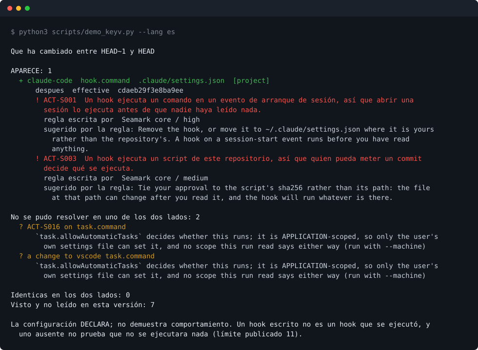
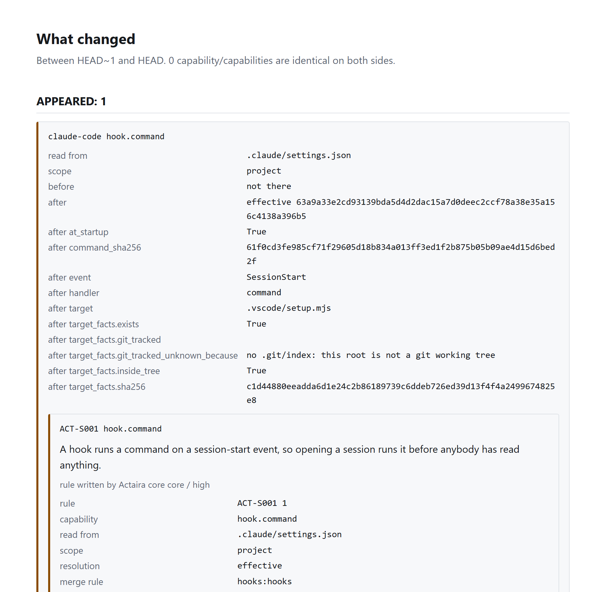

<div align="center">

# Actaira

**Control de cambios de lo que tus agentes de IA pueden hacer.**

Actaira lee la configuración que cargan tus agentes de código, resuelve lo que de verdad les permite hacer, y dice qué cambió entre dos momentos.

[](https://github.com/marcosmatalab/actaira/actions/workflows/ci.yml)
[](https://pypi.org/project/actaira/)
[](https://pypi.org/project/actaira/)
[](LICENSE)

**Actaira 3.0.0** · Apache-2.0 · una dependencia en tiempo de ejecución · sin conexión, sin telemetría, sin cuenta

**[English](README.md)** · [Comprobarlo en 60 segundos](#comprobar-esto-en-60-segundos) · [Quickstart](#quickstart) · [Comandos](docs/COMMANDS.md) · [Límites](docs/LIMITS.es.md)

</div>

---

## Comprobar esto en 60 segundos

Todas las cifras de esta página las mide un comando de este repositorio, no
están escritas a mano. Así se comprueban, sin conexión y sin cuenta:

```bash
pip install actaira && actaira scan --demo     # funciona sin ningún agente instalado
```

Y todo lo demás, desde un clon limpio:

```bash
git clone https://github.com/marcosmatalab/actaira && cd actaira
pip install -e ".[dev]"
make all        # lint, la suite con su suelo de cobertura, las cifras medidas, la puerta
```

O `make all` está verde o esta página está equivocada. El último paso es el que
merece la pena conocer: lee las afirmaciones de esta página y las resuelve
contra el parser del propio CLI, así que una frase de aquí que el código
contradiga rompe la build.

---

## Qué es esto

Un agente abre tu repositorio. Antes de que escribas nada ya ha leído un fichero
de ajustes que puede registrar un hook para ejecutarse al abrir sesión, una
lista de servidores MCP a los que conectarse, un conjunto de permisos, una
política de sandbox y un fichero de instrucciones. Esos ficheros llegan de
varios ámbitos a la vez (gestión, usuario, proyecto, local) y cada fabricante
documenta sus propias reglas para mezclarlos. La respuesta a «qué puede hacer
este agente aquí» no está escrita en ninguno de ellos.

Actaira lee esos ficheros, resuelve a qué suman, nombra cada capacidad con la
regla que la encontró, y dice qué ha cambiado desde la última vez.

No es un escáner de modelos. No es una plataforma de observabilidad. No es una
herramienta de cumplimiento. No es un EDR: no vigila en ejecución y no bloquea.

### Las tres afirmaciones, y dónde está cada una

Actaira afirma exactamente tres cosas y nada más. Cualquier cosa fuera de esas
tres es un defecto de producto, aunque sea verdad.

Cada bloque de abajo nombra los comandos sobre los que se sostiene su
afirmación, y eso no es una costumbre de formato: `scripts/release_check.py` lee
esos nombres y los resuelve contra el parser, en los dos sentidos. Un bloque que
diga «construido» nombrando un comando que nadie escribió rompe la puerta, y un
comando que funciona sin que ningún bloque lo reclame también.

**1. Superficie** - lo que un agente puede hacer aquí, resuelto entre ámbitos y
fabricantes. Cada capacidad cita el fichero del que sale, la regla de mezcla
documentada que la resolvió con la URL y la versión de la documentación del
fabricante que la enuncia, y la regla de Actaira que la nombra.

> **Construido.** Comandos: `actaira check`.
> Claude Code, Codex CLI, Cursor, Gemini CLI, los ficheros de tareas y ajustes
> de VS Code, `devcontainer.json` y los ficheros de instrucciones AGENTS.md /
> CLAUDE.md / GEMINI.md, cada uno contra su propia precedencia documentada. La
> superficie de un repositorio es la unión de los siete, nunca una mezcla.

**2. Cambio** - qué capacidad aparece, desaparece, se ensancha o se estrecha
entre dos momentos.

> **Construido.** Comandos: `actaira diff`, `actaira seal`.
> Dos refs de git, o dos directorios, comparados sin hacer checkout de ninguno.
> Qué aparece, qué desaparece, qué se ensancha, qué se estrecha, qué cambia con
> los dos digests, y aparte lo que no se pudo resolver en uno de los dos lados.
> La acción y el hook de pre-commit de aquí son el mismo comando, puesto donde
> entra el cambio.

**3. Vigencia** - si una aprobación o una evidencia sigue describiendo lo que
hay. Ligada a digests, nunca a nombres y nunca a fechas.

> **Construido en parte.** Comandos: `actaira seal`, `actaira verify`.
> `seal` firma una línea base que no lleva contenido, ligada al digest de la
> superficie, y `verify` la comprueba sin conexión y sin fiarse de quien la
> produjo. O sea que hoy se puede atar una aprobación a un digest y se puede
> demostrar que dejó de describir el árbol. Lo que no existe es el registro que
> guarda esas aprobaciones y las caduca por ti;
> [`docs/DESIGN.md`](docs/DESIGN.md) §10 conserva su razonamiento.

Y lo que ninguna de las tres puede afirmar, dicho aquí en vez de dejarlo a la
deducción: **la configuración declara; no demuestra comportamiento.** Un hook
escrito no es un hook que se ejecutó, y un hook ausente no prueba que no se
ejecutara nada. Lo que no se pudo resolver es INDETERMINADO, se cuenta aparte y
nunca se reparte entre las respuestas que sí se pudieron dar.

**Fuera de las tres afirmaciones**, y dicho aquí en vez de dejarlo sin cuadrar.
Dos comandos leen lo que un agente HIZO y no lo que puede hacer, y uno gestiona
una clave.

> **Fuera de las tres afirmaciones.** Comandos: `actaira scan`, `actaira watch`,
> `actaira keygen`.
> `scan` y `watch` son la [escalera de captura](#niveles-de-captura), que va de
> una ejecución y no de una configuración; `keygen` gestiona la clave con la que
> firma `seal`. Se conservan porque un cambio en una configuración y las
> sesiones que corrieron después son la misma pregunta hecha dos veces.

---

## Quickstart

```bash
pip install actaira
```

Una dependencia en tiempo de ejecución (`cryptography`). Nada más, sin cuenta y
sin red. Para trabajar en la herramienta, clónala y usa `pip install -e ".[dev]"`.

Después, para qué sirve el producto, sobre la oleada de keyv del 4 de agosto de
2026 reconstruida desde los informes publicados. El guion construye un
repositorio desechable con dos commits, limpio y después comprometido, y los
diferencia:



La misma salida en texto, para copiarla o compararla, está en
[`docs/COMMANDS.md`](docs/COMMANDS.md), donde la suite la ejecuta y la
compara con lo que imprime la herramienta.

Lee la mitad sin resolver, porque es el diseño. El gusano planta dos cosas y
esto dice algo de las dos: el hook de Claude Code sale EFECTIVO y lo nombran dos
reglas, y la tarea de `.vscode/tasks.json` sale INDETERMINADA, porque si se
ejecuta o no lo decide un ajuste que solo puede tener la máquina del usuario, así
que un repositorio no puede responderlo y esto se niega a adivinarlo. Contado
aparte, nunca mezclado.

La reconstrucción está en `tests/fixtures/surface/keyv-august/`, su fichero de
procedencia cita la frase de la que sale cada fragmento, y el `setup.mjs` al que
apunta el hook es un stub inerte. Un repositorio de seguridad que repartiera la
carga del gusano para demostrar que caza al gusano sería el gusano.

La misma ejecución escribe además el informe HTML autocontenido, con
`--html report.html`. Sin ningún script dentro y sin nada que se descargue de la
red, así que se abre en una máquina que no tiene ninguna de las dos cosas:



Y sin ningún agente instalado y sin nada configurado:

```console
$ actaira scan --demo

Reading the synthetic demo session shipped with the package.
  1 session(s), 4 tool call(s), from 2026-03-04T09:15:00.000Z to 2026-03-04T09:15:15.000Z
  1 session(s) declare a gap: something happened that was not observed

CAPTURE LEVEL L0: this transcript was written by the agent being audited, about
itself. Authenticity is not evaluated here and cannot be. It is diagnosis and
retrospective analysis, not evidence a third party can rely on. Use `actaira
watch` to record a run from outside the agent.
```

Ese bloque es el estilo de la casa en miniatura. Leyó una sesión, dijo lo que
vio, y a continuación dijo, sin que nadie se lo pidiera, que lo que acababa de
leer no puede sostener la afirmación que un lector le atribuiría. Con `--lang es`
la salida sale en español.

---

## Los siete comandos

```
actaira check     lee la configuración de agentes de este repo y resuelve qué permite
actaira diff      dice qué capacidad cambió entre dos momentos
actaira seal      firma una línea base de la superficie, sin llevar contenido
actaira verify    verifica un paquete firmado sin conexión
actaira keygen    crea, rota o revoca una clave de firma
actaira scan      lee las sesiones que un agente ya grabó en esta máquina (L0)
actaira watch     graba una ejecución desde fuera del agente, con un proxy MCP (L1)
```

Esa es la lista completa de lo que funciona: 7 comandos de CLI, y `actaira
--help` imprime los mismos siete. Los dos de abajo son el producto;
[`docs/COMMANDS.md`](docs/COMMANDS.md) es la referencia completa de todos ellos.

### `actaira check` - qué puede hacer un agente aquí

`check` lee la configuración de agentes de este repositorio, resuelve qué
permite de verdad entre ámbitos y entre fabricantes, y aplica los paquetes de
reglas. Lee Claude Code, Codex CLI, Cursor, Gemini CLI, `.vscode/tasks.json` y
`.vscode/settings.json`, `devcontainer.json`, y los ficheros de instrucciones
AGENTS.md, CLAUDE.md y GEMINI.md, contra 32 reglas documentadas.

Cada fabricante se resuelve contra la precedencia que publica su propia
documentación, porque esas escaleras no coinciden: Claude Code pone el fichero
del usuario por encima del del proyecto, Gemini CLI pone el del proyecto por
encima del del usuario, y VS Code pone el del espacio de trabajo por encima de
los dos. La superficie de un repositorio es por tanto la UNIÓN de las siete
superficies por fabricante, y dos fabricantes que configuran el mismo servidor
MCP son dos capacidades con el mismo digest, no una fila que no es de ninguno.

Lo que sigue sin leerse se imprime, no se salta, incluidos los dos ámbitos que
no dejan fichero alguno: los hooks de equipo de Cursor, configurados en un panel
y sincronizados a los miembros, y los requisitos de Codex que llegan por MDM o
desde la nube. Esos salen INDETERMINADOS con su causa, nunca como ausencia.

```
actaira check                                   # este repositorio
actaira check --machine                         # y los ámbitos de usuario y gestionado
actaira check --agent-version claude-code=2.1.257
actaira check --json                            # un documento surface/v1
actaira check --html informe.html               # un solo fichero, sin red
```

Tres cosas que no hará. Nunca ejecuta lo que lee: de un script al que apunta un
hook registra cuatro hechos (si existe, si está dentro del árbol, si lo controla
git y su sha256) y jamás un quinto. No imprime literales de comandos, URLs ni
cabeceras sin `--with-content`, porque un fichero de configuración puede llevar
un secreto y este informe se pega en un log de CI. Y nunca adivina: una
capacidad cuya respuesta dependa de una versión del agente que nadie declaró
sale INDETERMINADA con el umbral nombrado, y se cuenta aparte de todo lo demás.

Códigos de salida: `0` no disparó nada y no quedó nada sin resolver, `1` disparó
una regla, `3` no disparó nada y algo no se pudo resolver.

### `actaira diff` - qué ha cambiado

```
actaira diff main HEAD                          # dos refs de este repositorio
actaira diff --repo ../otro main feature        # de otro sitio
actaira diff --from-dir a --to-dir b            # dos árboles, sin git
actaira diff main HEAD --html informe.html      # y el mismo informe como página
actaira diff main HEAD --sarif actaira.sarif    # SARIF 2.1.0 para un host de código
```

De ninguna de las dos refs se hace checkout. Los dos árboles se leen con
`git ls-tree` y `git cat-file`, que no ejecutan ningún hook, no aplican ningún
filtro ni ningún driver de textconv, y se escriben en un directorio temporal que
se borra al salir. Tu árbol de trabajo no se toca, tu HEAD no se mueve, y a un
hook `post-checkout` del repositorio que se está examinando no se le da nunca la
ocasión de ejecutarse, que sería ejecutar código de otro para responder una
pregunta sobre código de otro. Una ref que empieza por guion se rechaza con
código de salida `2`.

Cinco tipos de cambio, y una sexta cosa que no es uno de ellos. Una capacidad
APARECE, DESAPARECE, SE ENSANCHA, SE ESTRECHA o CAMBIA; y si uno de los dos lados
no se pudo resolver, el cambio es INDETERMINADO, va en su propia lista con su
causa y nunca se cuenta con los cinco. Ensancharse y estrecharse solo existen
donde el nombre del propio hecho dice cuál de los dos valores es el más ancho,
como `guardrail_removed` pasando de false a true. En todo lo demás la respuesta
es CAMBIA, con los dos digests, para que quien revisa decida por su cuenta en vez
de que le digan qué pensar de los ajustes de un fabricante.

Códigos de salida: `1` una regla disparó sobre algo añadido o ensanchado, `3`
ninguna regla disparó y algo no se pudo resolver, `0` en el resto, `2` error de
uso. Un hallazgo que ya estaba y sigue estando no es ninguno de estos: para eso
está `check`, y un comando que responde «qué ha cambiado» no debe objetar a lo
que no cambió.

### En un pull request: la acción y el hook de pre-commit

La acción es este repositorio. `uses: marcosmatalab/actaira@<sha>` instala la
herramienta desde el ref que fijaste y ejecuta `diff` entre la base y la cabeza
del pull request:

```yaml
name: actaira
on: pull_request
permissions:
  contents: read
jobs:
  surface:
    runs-on: ubuntu-latest
    steps:
      - uses: actions/checkout@fbc6f3992d24b796d5a048ff273f7fcc4a7b6c09  # v5
        with:
          fetch-depth: 0       # diff necesita los dos lados, o sea la historia entera
          persist-credentials: false
      - uses: marcosmatalab/actaira@c0a33675c14b8a622ddb794ab3f516a514e3124d
```

**Los dos `uses:` van fijados por SHA de commit, y eso no es decoración.** Una
etiqueta es un nombre y un nombre se mueve, que es lo que ACT-S003 le dice al
mundo sobre sus propios servidores MCP y sus hooks; un ejemplo que te dijera
`@main` sería esta herramienta pidiéndote lo que señala en tu repositorio.
`@v3.0.0` es la forma legible de ese SHA, y el ejemplo de aquí sigue siendo el
digest porque eso es lo que se recomienda. Para volver a resolverlo:
`gh api repos/<owner>/<repo>/git/ref/tags/<tag> --jq .object.sha`.

Escribe el informe en el resumen del trabajo y SARIF 2.1.0 en `actaira.sarif`.
Subirlo a code scanning es un paso con `github/codeql-action/upload-sarif`, y
este repositorio lo da sobre sus propios pushes: el trabajo `dogfood` ejecuta
esta acción sobre Actaira y manda el resultado a la pestaña Security de Actaira.
El código de salida pasa tal cual, así que una regla que disparó sobre algo
nuevo hace fallar el trabajo; si eso bloquea el merge lo decide tu protección de
rama. `comment: true` publica el resumen como comentario del pull request y
necesita `pull-requests: write`, por eso está apagado por defecto.

**Úsala con `pull_request`. No con `pull_request_target` haciendo checkout de la
cabeza**, que le da al código de un fork un token con escritura y tus secretos,
y ningún cuidado tomado dentro de la acción lo cambia. Cada entrada llega al
shell por `env` en vez de pegarse dentro de un script con `${{ }}`, cada acción
de terceros de los flujos de aquí está fijada por SHA de commit, y `zizmor`
corre sobre `action.yml` y `.github/workflows/` en cada build.

Para un hook local, este repositorio publica uno:

```yaml
repos:
  - repo: https://github.com/marcosmatalab/actaira
    rev: c0a33675c14b8a622ddb794ab3f516a514e3124d
    hooks:
      - id: actaira-check
```

`check` y no `diff`, porque `pre-commit` tiene un árbol delante y un diff
necesita dos momentos. El sitio donde existen dos momentos es el pull request.

---

## Niveles de captura

Cada acta declara el nivel al que se capturó, y **el nivel decide qué puede
afirmar el acta**. Esta es la diferencia entre evidencia y diagnóstico, y no es
un detalle.

| Nivel | Qué es | Qué puede afirmar |
|---|---|---|
| **L0** | El transcript que el propio agente escribió - lo que Claude Code, Cursor o Cline ya guardaron en disco. Trae las llamadas de herramienta con sus argumentos. | **No puede afirmar autenticidad.** Lo produjo el auditado. Se declara como no evaluada, con su razón escrita. Diagnóstico y análisis retrospectivo, no evidencia para un tercero. |
| **L1** | Un proxy de MCP. Capturado desde fuera del agente. | Ve llamadas de herramienta. |
| **L2** | Un proxy de red. | Ve las llamadas de herramienta y las llamadas al proveedor del modelo. |
| **L3** | Un sandbox con seccomp. | Ve ficheros, red y ejecución. El único nivel que puede afirmar que no se tocó nada más. |

`scan` es L0. `watch` es L1. L2 y L3 no están implementados en este árbol.

Un nivel que no se emprendió no puede hacer inconcluso el veredicto. Uno que
estaba en alcance y falló, sí - y lo hace.

---

## Lo que Actaira se niega a hacer

Cuatro invariantes. Son el argumento, no una guía de estilo. Un cambio que viole
una se rechaza sin discusión.

**1. Nunca un número.** No hay score, grade, rating, percent, confidence ni
ranking en ningún documento emitido. Una regla puede traer una `severity`
escrita por el autor de su paquete: eso es una etiqueta atribuida, no un cálculo
de Actaira, y nunca se agrega con otra.

**2. Nunca juzgar, solo citar.** Actaira no tiene opinión sobre lo que un agente
debería haber hecho. Compara lo observado contra una norma **escrita por otro** y
la nombra, publicando el id de esa regla, su versión, su paquete y su autor. De
aquí se sigue: ningún modelo en el camino de decisión. Un LLM puede ayudar a
redactar una regla; no puede evaluarla ni escribir su remediación.

**3. Nunca inferir lo no observado.** Un predicado sin información devuelve
INDETERMINADO, jamás False. Cada regla declara lo que necesita para responder, y
por debajo de eso devuelve INDETERMINADO sola, sin que nadie se acuerde de
comprobarlo.

**4. Nunca actuar sobre lo que se observa.** Actaira *sugiere* la remediación
que trae su regla, nunca la aplica. Un testigo que además actúa no puede dar fe
de sus propios actos, y ese conflicto de interés es lo que nos separa de un
proveedor de observabilidad. Un código de salida **informa**: si un pull request
se bloquea o no lo decide tu protección de rama, que es tuya. Salir con código
distinto de cero no es actuar; escribir en tu árbol sí.

Las cuatro están afirmadas sobre código que existe: la primera en
`tests/test_no_aggregate.py` sobre todos los documentos que este árbol emite, la
segunda en cada hallazgo llevando el autor y el paquete de su regla, la tercera
en `Clause.holds` devolviendo None ante un hecho que nadie escribió, y la cuarta
en `diff` leyendo dos árboles sin hacer checkout de ninguno.

---

## Cómo se construyó esto

Lo construyó una sola persona, con uso intensivo de un asistente de código con
IA, en un tramo intenso de septiembre de 2026. Las fechas de los commits lo
dicen y no tiene sentido fingir otra cosa.

Qué significa eso en la práctica, dicho para que se pueda juzgar en vez de
suponer: las decisiones de producto, las cuatro negativas, el pivote desde el
escáner de modelos y todas las alternativas rechazadas de
[`docs/DESIGN.md`](docs/DESIGN.md) son mías. El asistente escribió buena parte
de la implementación y de los tests contra esas decisiones. Cada línea se
revisó, y la revisión no es algo que haya que creerse: las puertas de este
repositorio existen porque la asistencia a esta velocidad produce exactamente el
fallo que ellas cazan.

`tests/test_reachability.py` es el ejemplo más claro. Escribir rápido dejó casi
la mitad de este árbol inalcanzable desde cualquier comando, y eso no se veía
desde dentro de ningún fichero. El test falla ahora con un módulo que ningún
comando alcanza, y el código muerto se fue. `scripts/release_check.py` es el
otro: lee las afirmaciones de este README y las resuelve contra el parser del
CLI, porque una página escrita junto al código que describe se separa de él en
cuestión de días.

Si quieres saber si la persona detrás de esto entiende lo que hay aquí, la
prueba honesta es [`docs/DESIGN.md`](docs/DESIGN.md): cada decisión de diseño
con la alternativa que se rechazó y por qué. Esa es la parte que ningún
asistente escribió por mí.

---

## Cómo se sostiene el repositorio

Todas las cifras de abajo salen de un comando. Corre cualquiera y discrepa.

| Afirmación | Comando | Resultado |
|---|---|---|
| 2.544 tests | `python -m pytest --collect-only -q` | la misma cuenta |
| 15.803 líneas de código de producto | `find src -name '*.py' \| xargs cat \| wc -l` | la misma cuenta |
| 39.736 líneas de Python en el árbol | `python scripts/figures.py` | `docs/FIGURES.md`, por área |
| 32 reglas documentadas | `python scripts/rules_doc.py` | `docs/RULES.md`, desde los paquetes |
| 7 comandos de CLI, y no hay un octavo | `actaira --help` | los siete de arriba |
| el suelo de cobertura aguanta | `make test-cov` | el suelo es 88 y el árbol mide 90 |
| el árbol no se contradice | `python scripts/release_check.py` | cada comprobación nombrada, o un fallo con nombre |

El paquete lleva 6 documentos de esquema: 4 contratos versionados vivos y
2 versiones sustituidas que se leen y no se escriben nunca. El índice es
[`docs/CONTRACTS.md`](docs/CONTRACTS.md), generado desde los esquemas que lleva
el paquete en vez de escrito a mano, y
[`docs/COMPATIBILITY.md`](docs/COMPATIBILITY.md) anota qué sustituyó a cada uno
y por qué. Los nombres de campo siguen las convenciones GenAI de OpenTelemetry;
no inventamos vocabulario donde ya existe.

```bash
make all      # lint, test-cov, figures, release-check
```

Dos de esas son puertas y no decoración. `scripts/release_check.py` rechaza un
árbol cuyas partes no concuerdan: una cifra que se separó de lo que mide el
código, un flag que la documentación enseña y el comando no tiene, un objetivo
de make que una página nombra y no existe, un fixture que nadie lee, una
afirmación de esta página que el parser contradice. Y
`tests/test_reachability.py` falla con un módulo que ningún comando puede
alcanzar, que es como se descubrió que casi la mitad de este árbol era
inalcanzable y se quitó. `tests/test_layering.py` es la más reciente: dice qué
puede importar cada paquete y falla con una arista que la arquitectura no
permite.

Todo eso corre en CI sobre Python 3.11, 3.12 y 3.13, y este repositorio ejecuta
su propia Action sobre sus propios pushes y sube el resultado a code scanning.
[`docs/ENGINEERING.md`](docs/ENGINEERING.md) tiene las puertas, el trinquete de
tipos y el ledger de defectos.

---

## Documentación, alcance y licencia

| | |
|---|---|
| [`docs/COMMANDS.md`](docs/COMMANDS.md) | Los siete comandos enteros, con sus flags y sus códigos de salida. |
| [`docs/LIMITS.es.md`](docs/LIMITS.es.md) | Lo que Actaira no puede enseñarte, y por qué nada de ello se ablanda para vender mejor. |
| [`CLAUDE.md`](CLAUDE.md) | Qué es Actaira, las negativas, y las reglas que sigue el trabajo. El documento de gobierno. |
| [`docs/DESIGN.md`](docs/DESIGN.md) | Cada decisión de diseño con su alternativa rechazada, nombrando el fichero y la línea que la implementa. |
| [`docs/RULES.md`](docs/RULES.md) | Cada regla, con su autor, su versión, los hechos que necesita y su configuración violadora. Generado desde los paquetes. |
| [`docs/CONTRACTS.md`](docs/CONTRACTS.md) · [`docs/COMPATIBILITY.md`](docs/COMPATIBILITY.md) | Qué prometen los documentos, y qué se promete entre versiones. |
| [`docs/ENGINEERING.md`](docs/ENGINEERING.md) · [`docs/BACKLOG.md`](docs/BACKLOG.md) | Las puertas y el ledger de defectos; defectos conocidos y trabajo aplazado. |
| [`docs/GOVERNANCE.md`](docs/GOVERNANCE.md) | La frontera entre este núcleo abierto y un producto hospedado, si alguna vez se construye. |
| [`docs/archive/`](docs/archive/) | La documentación del escáner de modelos, archivada sin editar. Nada de ella describe este árbol. |

Este repositorio es el núcleo abierto: el CLI, el formato de traza, los paquetes
de reglas, el informe y, con el tiempo, el colector autoalojable. Hoy no hay
plataforma hospedada; [`docs/GOVERNANCE.md`](docs/GOVERNANCE.md) deja escrito de
antemano qué podría y qué no podría cruzar a una.

[`CONTRIBUTING.md`](CONTRIBUTING.md), [`CODE_OF_CONDUCT.md`](CODE_OF_CONDUCT.md),
[`SECURITY.md`](SECURITY.md). Bajo licencia [Apache-2.0](LICENSE).
