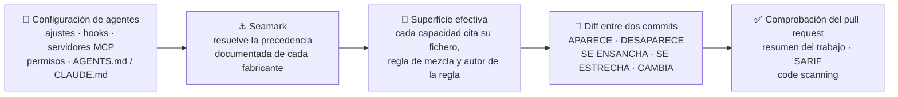

<div align="center">

# ⚓ Seamark

**Control de cambios de lo que tus agentes de IA pueden hacer.**

Seamark lee la configuración que cargan tus agentes de código, resuelve lo que de verdad les permite hacer, y te dice exactamente qué cambió entre dos commits.

[](https://github.com/marcosmatalab/seamark/actions/workflows/ci.yml)
[](pyproject.toml)
[](LICENSE)
[](#-comprobar-esto-en-60-segundos)
[](#en-un-pull-request-la-acción-y-el-hook-de-pre-commit)
[](#en-un-pull-request-la-acción-y-el-hook-de-pre-commit)

**Seamark 3.0.1** · Apache-2.0 · una dependencia en tiempo de ejecución · sin conexión, sin telemetría, sin cuenta

**[English](README.md)** · [Qué hace](#-qué-hace-en-palabras-sencillas) · [Inicio rápido](#-inicio-rápido) · [Compromisos](#-compromisos-de-diseño) · [Comandos](docs/COMMANDS.md) · [Diseño](docs/DESIGN.md)

```bash
pip install "git+https://github.com/marcosmatalab/seamark@v3.0.1" && seamark check
```

</div>

---

## 💡 Qué hace, en palabras sencillas

Los agentes de código con IA (Claude Code, Cursor, Codex CLI, Gemini CLI) leen
configuración de tu repositorio **antes de que escribas nada**: hooks
que ejecutan comandos al abrir sesión, servidores MCP a los que se conectan,
permisos, política de sandbox, ficheros de instrucciones. Un pull request puede
dar a un agente poderes nuevos sin que nadie lo note, y ningún fichero por sí
solo dice qué tiene permitido hacer el agente.

**Seamark es el diff de esos poderes.** Responde a tres preguntas:

| | Pregunta | Comando |
|:-:|---|---|
| 🔍 | *¿Qué puede hacer un agente en este repositorio ahora mismo?* | `seamark check` |
| 🔀 | *¿Qué añadió, quitó, ensanchó o estrechó este pull request?* | `seamark diff` |
| 🔏 | *¿La aprobación que firmé sigue describiendo lo que hay?* | `seamark seal` · `seamark verify` (construido en parte) |

### ⚙️ Cómo funciona, en cuatro pasos

1. **Leer.** Encuentra la configuración de agentes de siete fuentes en el
   repositorio, y con `--machine` en los ámbitos de usuario y gestionado: ajustes,
   hooks, listas de servidores MCP, permisos, política de sandbox, ficheros de
   instrucciones. Los analiza y nunca los ejecuta; un fichero que ve y aún no
   sabe leer se lista, no se omite.
2. **Resolver.** Aplica la precedencia documentada de cada fabricante para
   calcular la *superficie efectiva*: lo que el agente puede hacer de verdad una
   vez mezclados todos los ficheros.
3. **Nombrar.** Aplica 32 reglas documentadas sobre esa superficie. Cada hallazgo
   cita el fichero, la regla de mezcla (trazable hasta la página del fabricante
   de la que se leyó) y el autor de la regla.
4. **Comparar.** Resuelve dos commits de la misma forma e informa de cada
   capacidad como APARECE, DESAPARECE, SE ENSANCHA, SE ESTRECHA o CAMBIA, con un
   código de salida sobre el que CI puede actuar.



**Un ataque real, y la salida real.** Un gusano de cadena de suministro planta un
hook de agente en un repositorio; un solo `diff` lo nombra, cita las reglas que
dispararon, y se niega a adivinar lo que solo puede decidir la máquina del usuario:


---

## 🎯 Por qué importa

La configuración de los agentes se ha convertido en superficie ejecutable. Un
hook en `.claude/settings.json` ejecuta un comando de shell en cuanto se abre una
sesión, una entrada en `.mcp.json` está a una aprobación de lanzar un servidor
con las credenciales del desarrollador, y una tarea en `.vscode/tasks.json` puede
ejecutarse al abrir la carpeta. La oleada de cadena de suministro de keyv de
agosto de 2026 usó dos de ellos: el hook y la tarea.

La revisión de código está mal situada para detectarlo:

- **Disperso.** La respuesta abarca varios ficheros, ámbitos y fabricantes, cada uno con sus reglas de mezcla.
- **Opaco en un diff.** Un cambio de una línea en un JSON puede dar acceso a la shell; quien revisa ve sintaxis, no capacidades.
- **Dependiente del contexto.** Que una línea tenga efecto puede depender de ficheros que no están en el pull request.

Seamark lo convierte en una sola respuesta revisable y citada: *este pull request
le da al agente un hook que se ejecuta al abrir sesión, y esta es la regla que
explica por qué importa.*

---

## 📊 De un vistazo

<div align="center">

| 🧪 Calidad | 📦 Alcance | ⚙️ Integración |
|---|---|---|
| **2.724 tests**, ejecutados en Python 3.11, 3.12 y 3.13 | **32 reglas documentadas** en paquetes versionados | **7 comandos de CLI**, una dependencia en tiempo de ejecución |
| **Puerta de cobertura** en CI: el suelo es 88 y el árbol mide 90 | **15.993 líneas de código de producto** | Acción de GitHub, hook de pre-commit, SARIF 2.1.0 |
| Puerta de release sobre cada cifra, flag y estado de afirmación | **4 contratos versionados** publicados como JSON Schema | Informe HTML autocontenido, sin red |

</div>

Cada cifra de arriba la mide un comando de este repositorio y la comprueba la
puerta de release; [la tabla de más abajo](#cómo-se-sostiene-el-repositorio-) dice
qué comando produce cada una.

### ✨ Por qué destaca

- 🧩 **Multifabricante, con la precedencia exacta.** Cada fabricante se resuelve
  contra el orden de mezcla que publica su propia documentación, y la superficie
  del repositorio es la unión de todos ellos.
- 📎 **Cada hallazgo va citado.** El fichero del que sale, la regla de mezcla con
  la URL, la fecha de lectura y un digest de la página del fabricante, y la regla
  que lo nombra con su autor y su paquete.
- 🔒 **Seguro por construcción.** Nunca ejecuta lo que lee, y `diff` lee los
  objetos de git directamente: sin checkout, sin hooks, sin filtros, sin mover HEAD.
- ❔ **Nunca adivina.** Lo que no se puede resolver desde el repositorio sale
  INDETERMINADO con su causa, contado aparte de las respuestas.
- 🔏 **Líneas base firmadas y verificables sin conexión.** Claves Ed25519 con
  rotación y revocación, ligadas a digests, nunca a nombres ni a fechas.
- 📴 **Privado por defecto.** Sin cuenta, sin telemetría; `check`, `diff`, `seal`
  y `verify` funcionan por completo sin conexión.
- 🌍 **Bilingüe.** Mensajes de la herramienta en inglés y en español
  (`--lang es`); el texto de una regla queda en el idioma en que lo escribió su autor.
- 🛡️ **Cadena de release blindada.** El flujo de release construye en un runner de
  CI y firma procedencia SLSA; cada acción de terceros va fijada por SHA de commit.
- ✅ **Documentación que se verifica sola.** La puerta de release comprueba cada
  comando, flag, cifra y estado de afirmación de esta página contra el código.

---

## ⏱ Comprobar esto en 60 segundos

Sin cuenta y sin ningún agente; tras la instalación, todo funciona sin conexión:

```bash
git clone https://github.com/marcosmatalab/seamark && cd seamark
pip install -e . && python scripts/demo_keyv.py     # el diff de keyv de la imagen de arriba
```

Y la puerta entera, que tarda más:

```bash
pip install -e ".[dev]" && make all   # lint, la suite con su suelo de cobertura, las cifras medidas, las dos puertas
```

Si `make all` está en verde, cada comando, flag, cifra y estado de afirmación de
esta página concuerda con el código: la puerta de release lee la página y hace
fallar la build ante cualquier desvío.

---

## 🧭 Qué es esto

Una herramienta de control de cambios para la configuración de agentes: lee,
resuelve e informa, y nunca bloquea ni ejecuta nada. La configuración llega de
varios ámbitos a la vez (gestionado, usuario, proyecto, local), y Seamark
resuelve la escalera de cada fabricante tal como ese fabricante la documenta.

### Las tres afirmaciones

Seamark hace exactamente tres afirmaciones. Cada bloque de abajo nombra los
comandos sobre los que se sostiene, y `scripts/release_check.py` resuelve esos
nombres contra el parser en los dos sentidos, así que una afirmación de aquí no
puede separarse del código.

**1. Superficie** - lo que un agente puede hacer aquí, resuelto entre ámbitos y
fabricantes. Cada capacidad cita el fichero del que sale, la regla de mezcla
documentada que la resolvió con la URL, la fecha de lectura y un digest de la página del
fabricante que la enuncia, y la regla de Seamark que la nombra.

> **Construido.** Comandos: `seamark check`.
> Claude Code, Codex CLI, Cursor, Gemini CLI, los ficheros de tareas y ajustes
> de VS Code, `devcontainer.json` y los ficheros de instrucciones AGENTS.md /
> CLAUDE.md / GEMINI.md, cada uno contra su propia precedencia documentada. La
> superficie de un repositorio es la unión de los siete, nunca una mezcla.

**2. Cambio** - qué capacidad aparece, desaparece, se ensancha o se estrecha
entre dos momentos.

> **Construido.** Comandos: `seamark diff`, `seamark seal`.
> Dos refs de git, o dos directorios, comparados sin hacer checkout de ninguno.
> Qué aparece, qué desaparece, qué se ensancha, qué se estrecha, qué cambia con
> los dos digests, y aparte lo que no se pudo resolver en uno de los dos lados.
> La acción lo ejecuta en cada pull request, que es donde entra el cambio.

**3. Vigencia** - si una aprobación o una evidencia sigue describiendo lo que
hay. Ligada a digests, nunca a nombres y nunca a fechas.

> **Construido en parte.** Comandos: `seamark seal`, `seamark verify`.
> `seal` firma una línea base que no lleva contenido, ligada al digest de la
> superficie, y `verify` la comprueba sin conexión y sin fiarse de quien la
> produjo. Una aprobación queda atada exactamente a la configuración que aprobó,
> y deja ver el momento en que deja de describir el árbol.

**Más allá de las tres afirmaciones**, dos comandos leen lo que un agente HIZO y
no lo que puede hacer, y uno gestiona una clave.

> **Fuera de las tres afirmaciones.** Comandos: `seamark scan`, `seamark watch`,
> `seamark keygen`.
> `scan` y `watch` son la [escalera de captura](#-niveles-de-captura), que va de
> una ejecución y no de una configuración; `keygen` gestiona la clave con la que
> firma `seal`.

---

## 🚀 Inicio rápido

```bash
pip install "git+https://github.com/marcosmatalab/seamark@v3.0.1"
```

Una dependencia en tiempo de ejecución (`cryptography`). Sin cuenta y sin red.
Para trabajar en la herramienta, clónala y usa `pip install -e ".[dev]"`.

Para esto sirve el producto, sobre la oleada de cadena de suministro de keyv del
4 de agosto de 2026, reconstruida desde los informes publicados.
`scripts/demo_keyv.py` construye un repositorio desechable con dos commits, limpio y después
comprometido, y compara los dos; su salida es la imagen
[del principio de esta página](#-qué-hace-en-palabras-sencillas).
La misma salida en texto, para copiarla o compararla, está en
[`docs/COMMANDS.md`](docs/COMMANDS.md), donde la suite la ejecuta y la compara
con lo que imprime la herramienta.

El gusano planta dos cosas y Seamark informa de las dos: el hook de Claude Code
sale EFECTIVO y lo nombran dos reglas, y la tarea de `.vscode/tasks.json` sale
INDETERMINADA, porque si se ejecuta o no lo decide un ajuste que solo vive en la
máquina del usuario. Seamark lo dice en vez de adivinar.

La reconstrucción está en `tests/fixtures/surface/keyv-august/`, su fichero de
procedencia cita la frase de la que sale cada fragmento, y el `setup.mjs` al que
apunta el hook es un stub inerte.

La misma ejecución escribe además un informe HTML autocontenido con
`--html report.html`. Sin ningún script dentro y sin nada que se descargue de la
red, así que se abre en cualquier sitio:


Y sin ningún agente instalado y sin nada configurado:

```console
$ seamark scan --demo

Reading the synthetic demo session shipped with the package.
  1 session(s), 4 tool call(s), from 2026-03-04T09:15:00.000Z to 2026-03-04T09:15:15.000Z
  1 session(s) declare a gap: something happened that was not observed

CAPTURE LEVEL L0: this transcript was written by the agent being audited, about
itself. Authenticity is not evaluated here and cannot be. It is diagnosis and
retrospective analysis, not evidence a third party can rely on. Use `seamark
watch` to record a run from outside the agent.
```

Leyó una sesión, dijo lo que vio, y precisó qué puede sostener esa evidencia y
qué no. Ese es el estilo de la casa. Con `--lang es` la salida sale en español.

---

## 🔧 Los siete comandos

```
seamark check     lee la configuración de agentes de este repo y resuelve qué permite
seamark diff      dice qué capacidad cambió entre dos momentos
seamark seal      firma una línea base de la superficie, sin llevar contenido
seamark verify    verifica un paquete firmado sin conexión
seamark keygen    crea, rota o revoca una clave de firma
seamark scan      lee las sesiones que un agente ya grabó en esta máquina (L0)
seamark watch     graba una ejecución desde fuera del agente, con un proxy MCP (L1)
```

7 comandos de CLI, y `seamark --help` imprime los mismos siete. Los dos de abajo
son el producto; [`docs/COMMANDS.md`](docs/COMMANDS.md) es la referencia completa.

### 🔍 `seamark check` - qué puede hacer un agente aquí

`check` lee la configuración de agentes de este repositorio, resuelve qué
permite de verdad entre ámbitos y entre fabricantes, y aplica los paquetes de
reglas. Lee Claude Code, Codex CLI, Cursor, Gemini CLI, `.vscode/tasks.json` y
`.vscode/settings.json`, `devcontainer.json`, y los ficheros de instrucciones
AGENTS.md, CLAUDE.md y GEMINI.md, contra 32 reglas documentadas.

Cada fabricante se resuelve contra la precedencia que publica su propia
documentación, porque esas escaleras difieren justo donde importa: Gemini CLI
parte su ámbito de sistema en dos ficheros situados en extremos opuestos de su
escalera, y VS Code ignora una clave de ámbito de aplicación escrita en un
fichero del espacio de trabajo. La superficie de un repositorio es por tanto la UNIÓN de las
superficies por fabricante, y dos fabricantes que configuran el mismo servidor
MCP son dos capacidades con el mismo digest.

```
seamark check                                   # este repositorio
seamark check --machine                         # y los ámbitos de usuario y gestionado
seamark check --agent-version claude-code=2.1.257
seamark check --json                            # un documento surface/v1
seamark check --html informe.html               # un solo fichero, sin red
```

Pensado para pegarse en CI con seguridad. Nunca ejecuta lo que lee: de un script
al que apunta un hook registra si existe, si está dentro del árbol, si lo
controla git y su sha256. No imprime literales de comandos, URLs ni cabeceras sin
`--with-content`, así que un secreto de un fichero de ajustes nunca llega a un log.

Códigos de salida: `0` no disparó nada y no quedó nada sin resolver, `1` disparó
una regla, `3` no disparó nada y algo no se pudo resolver, `2` error de uso.

### 🔀 `seamark diff` - qué ha cambiado

```
seamark diff main HEAD                          # dos refs de este repositorio
seamark diff --repo ../otro main feature        # de otro sitio
seamark diff --from-dir a --to-dir b            # dos árboles, sin git
seamark diff main HEAD --html informe.html      # y el mismo informe como página
seamark diff main HEAD --sarif seamark.sarif    # SARIF 2.1.0 para un host de código
```

De ninguna de las dos refs se hace checkout. Los dos árboles se leen con
`git ls-tree` y `git cat-file`, que no ejecutan ningún hook, no aplican ningún
filtro ni ningún driver de textconv, a un directorio temporal que se borra al
salir. Tu árbol de trabajo no se toca, tu HEAD no se mueve, y un hook
`post-checkout` del repositorio examinado nunca tiene ocasión de ejecutarse. Una
ref que empieza por guion se rechaza con código de salida `2`.

Una capacidad APARECE, DESAPARECE, SE ENSANCHA, SE ESTRECHA o CAMBIA; si uno de
los dos lados no se pudo resolver, el cambio es INDETERMINADO y va en su propia
lista con su causa. Ensancharse y estrecharse solo se usan donde el nombre del
propio hecho dice cuál de los dos valores es el más ancho, como
`guardrail_removed` pasando de false a true. En todo lo demás la respuesta es
CAMBIA, con los dos digests, y quien revisa decide.

Códigos de salida: `1` una regla disparó sobre algo añadido o ensanchado, `3`
ninguna regla disparó y algo no se pudo resolver, `0` en el resto, `2` error de
uso. Un hallazgo que ya estaba es cosa de `check`; `diff` informa del cambio.

### En un pull request: la acción y el hook de pre-commit

La acción es este repositorio. `uses: marcosmatalab/seamark@<sha>` instala la
herramienta desde la ref que fijaste y ejecuta `diff` entre la base y el head
del pull request:

```yaml
name: seamark
on: pull_request
permissions:
  contents: read
jobs:
  surface:
    runs-on: ubuntu-latest
    steps:
      - uses: actions/checkout@fbc6f3992d24b796d5a048ff273f7fcc4a7b6c09  # v5
        with:
          fetch-depth: 0       # diff necesita los dos commits; la forma más simple de tenerlos
          persist-credentials: false
      - uses: marcosmatalab/seamark@2c25f4981b12ff3f0854bbb79e2eaecb0a4be5ec
```

**Los dos `uses:` van fijados por SHA de commit, a propósito.** Una etiqueta es
un nombre y un nombre se mueve, y una dependencia sin fijar es justo lo que
ACT-S011 señala en los servidores MCP, así que el ejemplo sigue su propio
consejo. Para resolver una etiqueta a su SHA:
`gh api repos/<owner>/<repo>/git/ref/tags/<tag> --jq .object.sha`.

Escribe el informe en el resumen del trabajo y SARIF 2.1.0 en `seamark.sarif`.
Subirlo a code scanning es un paso con `github/codeql-action/upload-sarif`, y
este repositorio lo hace en sus propios pushes: el trabajo `dogfood` ejecuta
esta acción sobre Seamark y manda el resultado a la pestaña Security de Seamark.
El código de salida pasa tal cual, así que una regla que disparó sobre algo
nuevo hace fallar el trabajo. `comment: true` publica el resumen como comentario
del pull request y necesita `pull-requests: write`, por eso está apagado por defecto.

**Úsala con `pull_request`, no con `pull_request_target` haciendo checkout del
head**, que le da al código de un fork un token con escritura y tus secretos.
Cada entrada llega al shell por `env` en vez de interpolarse con `${{ }}`, cada
acción de terceros de los flujos de aquí está fijada por SHA de commit, y
`zizmor` audita `action.yml` y `.github/workflows/` en cada build.

Para un hook local, este repositorio publica uno:

```yaml
repos:
  - repo: https://github.com/marcosmatalab/seamark
    rev: 2c25f4981b12ff3f0854bbb79e2eaecb0a4be5ec
    hooks:
      - id: seamark-check
```

`check` y no `diff`, porque `pre-commit` tiene un árbol delante y un diff
necesita dos momentos. El sitio donde existen dos momentos es el pull request.

---

## 🪜 Niveles de captura

Cada registro declara el nivel al que se capturó, y **el nivel decide qué puede
afirmar el registro**. Esa es la diferencia entre evidencia y diagnóstico.

| Nivel | Qué es | Qué puede afirmar | En Seamark |
|---|---|---|---|
| **L0** | El transcript que el propio agente escribió, tal como Claude Code lo guarda en disco. Trae las llamadas de herramienta con sus argumentos. | **No puede afirmar autenticidad.** Lo produjo el auditado. Diagnóstico y análisis retrospectivo, no evidencia para un tercero. | `seamark scan` |
| **L1** | Un proxy de MCP. Capturado desde fuera del agente. | Ve llamadas de herramienta. | `seamark watch` |
| **L2** | Un proxy de red. | Ve las llamadas de herramienta y las llamadas al proveedor del modelo. | definido en el formato de traza |
| **L3** | Un sandbox con seccomp. | Ve ficheros, red y ejecución. El único nivel que puede afirmar que no se tocó nada más. | definido en el formato de traza |

---

## 🧱 Invariantes de diseño

Cuatro invariantes. Son el argumento, no una guía de estilo, y un cambio que
viole una se rechaza sin discusión.

**1. Nunca un número.** No hay score, grade, rating, percent, confidence ni
ranking en ningún documento emitido. Una regla puede traer una `severity`
escrita por el autor de su paquete: es una etiqueta atribuida, nunca agregada con
otra.

**2. Nunca juzgar, solo citar.** Seamark compara lo observado contra una norma
**escrita por otro** y la nombra, publicando el id de esa regla, su versión, su
paquete y su autor. Ningún modelo está en el camino de decisión. Las 32 reglas
documentadas vienen en el paquete `core`, atribuidas a su autor como cualquier otro.

**3. Nunca inferir lo no observado.** Un predicado sin información devuelve
INDETERMINADO, jamás False. Cada regla declara lo que necesita para responder, y
por debajo de eso devuelve INDETERMINADO sola.

**4. Nunca actuar sobre lo que se observa.** Seamark *sugiere* la remediación
que trae su regla, nunca la aplica. Un testigo que además actúa no puede dar fe
de sus propios actos. Un código de salida **informa**; si un pull request se
bloquea lo decide tu protección de rama.

Las cuatro están afirmadas sobre código que existe: la primera en
`tests/test_no_aggregate.py` sobre todos los documentos que este árbol emite, la
segunda en cada hallazgo llevando el autor y el paquete de su regla, la tercera
en `Clause.holds` devolviendo None ante un hecho que nadie escribió, y la cuarta
en `diff` leyendo dos árboles sin hacer checkout de ninguno.

---

## 📐 Compromisos de diseño

Cada decisión de abajo compra algo y cuesta algo, a propósito. Cada una se sigue
de las invariantes de arriba; el razonamiento está en
[`docs/PRINCIPLES.md`](docs/PRINCIPLES.md) y [`docs/DESIGN.md`](docs/DESIGN.md).

| Decisión | Qué ganas | Qué cuesta |
|---|---|---|
| **Leer, nunca ejecutar** | Hecho para pasarse sobre pull requests no fiables | Informa de lo que la configuración *declara*, no de lo que se ejecutó |
| **INDETERMINADO antes que adivinar** | Algo desconocido nunca se da por seguro | Algunas respuestas quedan para una persona, como los ajustes que solo tiene la máquina del usuario |
| **Reglas citadas, sin puntuaciones** | Cada hallazgo es atribuible y auditable | No hay un único número de riesgo para ordenar el backlog |
| **Ningún modelo en el camino de decisión** | Misma entrada, mismos bytes; la puerta de release repite la salida con dos semillas de hash | La cobertura es exactamente lo que describen los paquetes de reglas |
| **Objetos de git, no un checkout** | Nunca se ejecuta ningún hook, filtro ni driver de textconv | Cada lado se copia a un árbol temporal, y un árbol demasiado grande se rechaza en vez de leerse a medias |
| **Sin conexión, una sola dependencia** | Uso en entornos aislados y una cadena de suministro mínima | Sin panel hospedado; los informes son ficheros que conservas |

---

## 🔖 De dónde viene esto

Este repositorio se llamó **Actaira** hasta la 3.0.0. Ese nombre es de otro
producto del mismo autor, la plataforma del AI Act, que vive en su propio
repositorio y en `actaira.com`, así que este tomó su propio nombre. La
distribución, el comando y la ruta de importación son todos `seamark`. La etiqueta `v2.3.0` es el escáner de
modelos que este repositorio fue, archivado entero con el nombre con el que se
publicó. [`CHANGELOG.md`](CHANGELOG.md) traza la línea entre los dos.

---

## Cómo se sostiene el repositorio 🧰

Todas las cifras de abajo salen de un comando. Corre cualquiera y compara.

| Afirmación | Comando | Resultado |
|---|---|---|
| 2.724 tests | `python -m pytest --collect-only -q -o addopts=` | la misma cuenta |
| 15.993 líneas de código de producto | `find src -name '*.py' \| xargs cat \| wc -l` | la misma cuenta |
| 43.688 líneas de Python en el árbol | `python scripts/figures.py` | `docs/FIGURES.md`, por área |
| 32 reglas documentadas | `python scripts/rules_doc.py` | `docs/RULES.md`, desde los paquetes |
| 7 comandos de CLI, y no hay un octavo | `seamark --help` | los siete de arriba |
| el suelo de cobertura aguanta | `make test-cov` | el suelo es 88 y el árbol mide 90 |
| el árbol no se contradice | `python scripts/release_check.py` | cada comprobación nombrada, o un fallo con nombre |

El paquete lleva 6 documentos de esquema: 4 contratos versionados vivos y
2 versiones sustituidas que se leen y no se escriben nunca. El índice es
[`docs/CONTRACTS.md`](docs/CONTRACTS.md), generado desde los esquemas que lleva
el paquete, y [`docs/COMPATIBILITY.md`](docs/COMPATIBILITY.md) anota qué
sustituyó a cada uno y por qué. Los nombres de campo siguen las convenciones
GenAI de OpenTelemetry.

```bash
make all      # lint, test-cov, figures, release-check, history-check
```

Dos de esas son puertas y no decoración. `scripts/release_check.py` rechaza un
árbol cuyas partes no concuerdan: una cifra que se separó de lo que mide el
código, un flag que la documentación enseña y el comando no tiene, un objetivo
de make que una página nombra y no existe, un fixture que nadie lee, una
afirmación de esta página que el parser contradice. `tests/test_reachability.py`
falla con un módulo que ningún comando puede alcanzar, y
`tests/test_layering.py` dice qué puede importar cada paquete y falla con una
arista que la arquitectura no permite.

La suite corre en CI sobre Python 3.11, 3.12 y 3.13, y este repositorio ejecuta
su propia acción en sus propios pushes y sube el resultado a code scanning.
[`docs/ENGINEERING.md`](docs/ENGINEERING.md) tiene las puertas, el trinquete de
tipado (ratchet) y el registro de defectos.

---

## 📚 Documentación y licencia

| | |
|---|---|
| [`docs/COMMANDS.md`](docs/COMMANDS.md) | Los siete comandos enteros, con sus flags y sus códigos de salida. |
| [`docs/PRINCIPLES.md`](docs/PRINCIPLES.md) | Qué es Seamark, las invariantes, y las reglas que sigue el trabajo. |
| [`docs/DESIGN.md`](docs/DESIGN.md) | Cada decisión de diseño con su alternativa rechazada, nombrando el fichero y la línea que la implementa. |
| [`docs/RULES.md`](docs/RULES.md) | Cada regla, con su autor, su versión, los hechos que necesita y su configuración violadora. Generado desde los paquetes. |
| [`docs/CONTRACTS.md`](docs/CONTRACTS.md) · [`docs/COMPATIBILITY.md`](docs/COMPATIBILITY.md) | Qué prometen los documentos, y qué se promete entre versiones. |
| [`docs/ENGINEERING.md`](docs/ENGINEERING.md) · [`docs/BACKLOG.md`](docs/BACKLOG.md) | Las puertas, el registro de defectos y la hoja de ruta. |
| [`docs/GOVERNANCE.md`](docs/GOVERNANCE.md) | La frontera escrita entre este núcleo abierto y cualquier producto hospedado. |
| [`docs/archive/`](docs/archive/) | La documentación del escáner de modelos, archivada sin editar. |

📌 Los límites publicados están en [`docs/LIMITS.es.md`](docs/LIMITS.es.md).

Este repositorio es el núcleo abierto: el CLI, el formato de traza, los paquetes
de reglas y el informe. [`docs/GOVERNANCE.md`](docs/GOVERNANCE.md) deja escrito
de antemano qué podría y qué no podría cruzar a un producto hospedado.

[`CONTRIBUTING.md`](CONTRIBUTING.md), [`CODE_OF_CONDUCT.md`](CODE_OF_CONDUCT.md),
[`SECURITY.md`](SECURITY.md). Bajo licencia [Apache-2.0](LICENSE).
