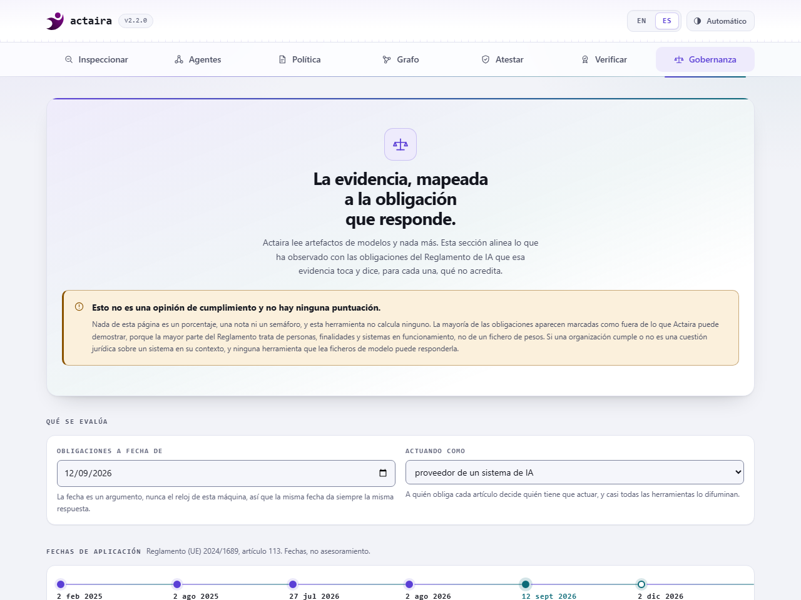
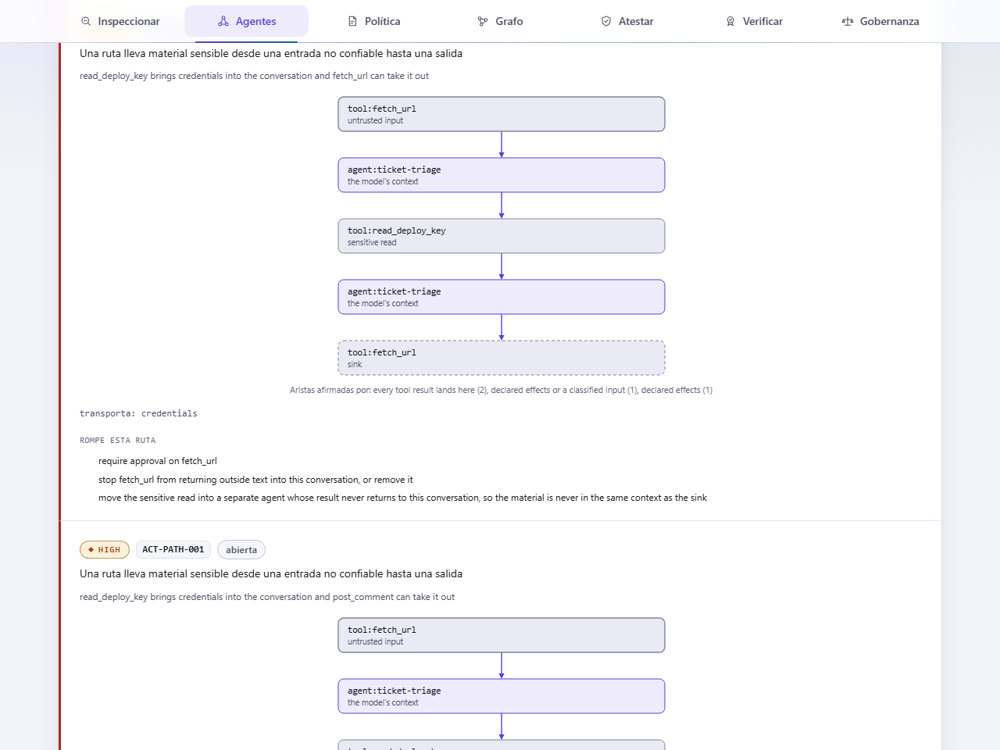
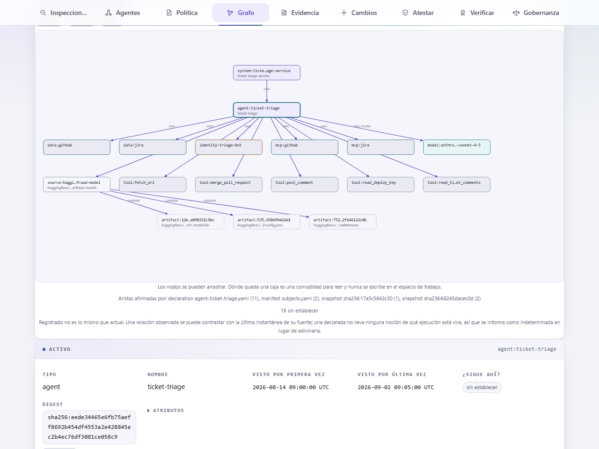
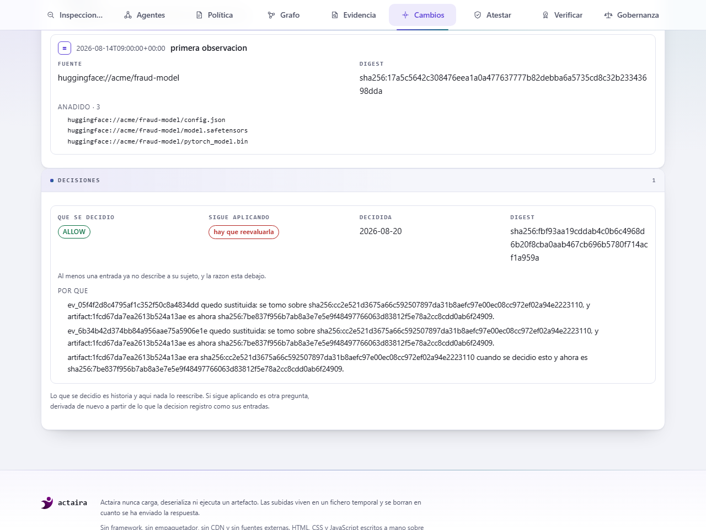
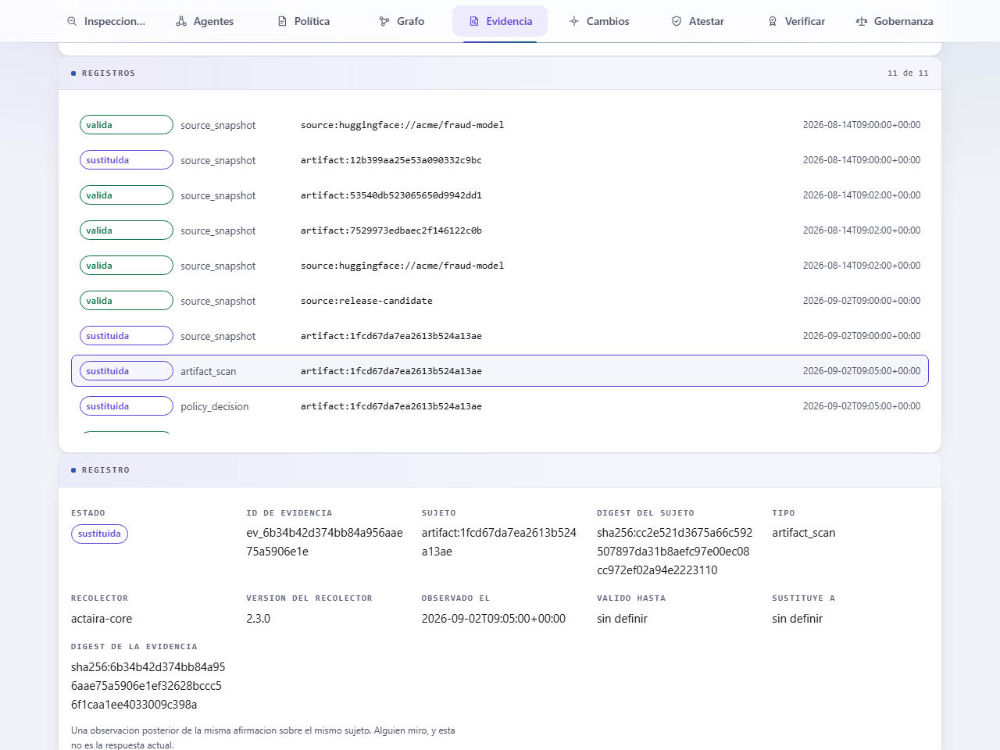
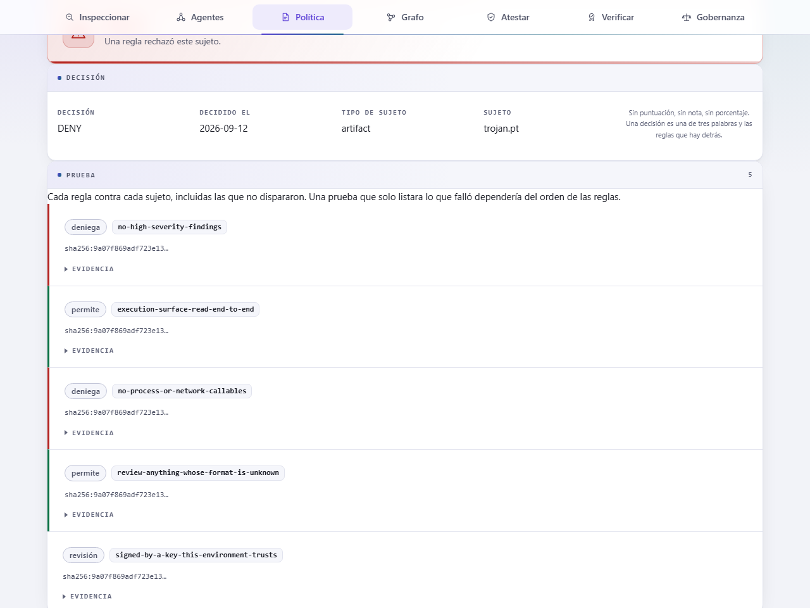

<div align="center">


**Garantía continua y verificable para modelos y agentes de IA.**

Actaira detecta qué cambió, muestra qué evidencia dejó de contar, traza exactamente qué queda afectado, y demuestra por qué. Inspecciona artefactos de modelo sin ejecutarlos, encuentra las rutas por las que se puede llevar a un agente, decide con políticas como código, y relaciona evidencia técnica con obligaciones del Reglamento de IA de la UE.

**Actaira 2.3.0** · Python 3.11 · 3.12 · 3.13 · MIT · una dependencia en tiempo de ejecución · local-first, sin telemetría, sin cuenta

**[English](README.md)** · [Qué hace](#qué-hace-actaira) · [Quickstart](#quickstart) · [Reglamento de IA](#el-reglamento-de-ia-de-la-ue) · [Arquitectura](#arquitectura) · [Evaluación](#evaluación) · [Docs](#dónde-vive-el-resto)

</div>

---

## Qué hace Actaira


Actaira lee un sistema de IA **sin ejecutarlo**, registra lo que observó como evidencia **con una vida útil**, decide bajo una **política versionada**, y firma un **recibo que un tercero puede verificar sin conexión**.

Nada se carga, se deserializa ni se ejecuta nunca. Nada se puntúa nunca.

---

## En cifras

| | | |
|---|---|---|
| **80 reglas documentadas** | **15 controles ejecutables** | **21 obligaciones** modeladas |
| **3.593 tests**, ninguna cifra escrita a mano | **7 conectores** que nunca deciden | una dependencia en tiempo de ejecución |

**No hace falta red** para escanear en local, para la gobernanza ni para verificar sin conexión. El descubrimiento remoto y el anclaje temporal RFC 3161 llegan a la red solo cuando se lo pides, `bundle` y `discover` aceptan `--offline` para prohibirlo del todo, y aquí nada llama a casa: no hay telemetría, ni cuenta, ni servicio alojado.

Cada cifra de esta página la mide `make figures` y la verja de release rechaza el árbol si alguna ha derivado. [`docs/FIGURES.md`](docs/FIGURES.md) es donde aterriza la medición, fuente por fuente.

---

## Míralo

`actaira serve` es el mismo motor detrás de un servidor HTTP de stdlib en 127.0.0.1, sin framework, sin bundler, sin CDN y sin fuentes externas. Lee; no decide nada que la CLI no decidiera.

**Inspeccionar.** Suelta un artefacto dentro, y el veredicto llega con el digest, los identificadores de regla, la evidencia detrás de cada hallazgo, y el alcance de la afirmación:

<picture>
  <source media="(prefers-color-scheme: dark)" srcset="docs/img/03-inspect-dark.png">
  
</picture>

**Gobernar.** Elige un rol y una fecha, y el panel muestra qué obligaciones vinculan, cuáles están fuera de lo que cualquier fichero puede mostrar, y por qué cada una está donde está:

<picture>
  <source media="(prefers-color-scheme: dark)" srcset="docs/img/08-governance-dark-es.png">
  
</picture>

Los dos paneles están en español e inglés, en claro y en oscuro, y cada captura la regenera `make screenshots` desde un servidor en marcha: la pasada falla ante un error de consola, un error de página, una petición fallida o una violación de la Content-Security-Policy, así que una imagen de aquí no puede mostrar una versión de la interfaz que ya no existe.

La interfaz cubre inspección, agentes, política, el grafo de activos e impacto, el registro de evidencia, la línea de cambios y la validez de las decisiones, atestación, verificación y gobernanza. El resto del motor se alcanza desde la CLI, y [el alcance](#alcance) dice qué partes vienen después. `tests/test_cli_ui_parity.py` sujeta esa frase a las rutas que el servidor responde de verdad, en los dos sentidos, así que no puede dejar de ser cierta en silencio.

---

## Por qué existe

**La evidencia caduca y nada te avisa.** Un informe de escaneo es cierto sobre los bytes que leyó el día que los leyó. En cuanto los pesos se mueven es una afirmación sobre un fichero que ya no existe, y la mayoría de las herramientas lo siguen mostrando. Actaira ata cada pieza de evidencia a un digest y la sustituye cuando ese digest desaparece.

**Una firma prueba origen, no inocuidad.** [OpenSSF Model Signing](https://github.com/ossf/model-signing-spec) y [sigstore/model-transparency](https://github.com/sigstore/model-transparency) responden *quién firmó esto y si los bytes están intactos*, correctamente, en producción, y su propia documentación dice que no analizan contenido malicioso. Un modelo puede estar perfectamente firmado por una identidad legítima y llevar un gadget dentro.

**Un porcentaje no es una respuesta de cumplimiento.** Las plataformas de compliance informan de una postura construida con afirmaciones que escribió una persona, y ponderar obligaciones de distinta naturaleza exige un número que nadie tiene. Actaira publica qué miró cada control y qué no, y se niega a producir una puntuación: un test busca `score`, `grade`, `rating` y `percent` en cada documento terminado y falla si aparece alguno.

**Un modelo moderno no es un fichero, y un agente moderno no es una lista de herramientas.** Cuatro shards, un índice, un adaptador que apunta a un modelo base en otro sitio y un `modeling_custom.py` que `transformers` ejecuta con `trust_remote_code=True`: cada fichero benigno por separado, y el riesgo en las relaciones entre ellos. La misma forma un nivel más arriba, donde una herramienta que lee comentarios de tickets está bien, una herramienta que hace merge de pull requests está bien, y un agente con las dos es el incidente.

**"¿A qué más llega esto?" no tiene respuesta dentro de un escáner.** En cuanto un fichero de pesos se mueve, la pregunta es qué bundles, agentes y sistemas dependían de él, por qué arista declarada, y qué evidencia almacenada acaba de dejar de ser cierta.

### Dónde encaja

Categorías de herramienta, no productos con nombre. La comparación medida frente a picklescan, modelscan y fickling está en [`docs/EVALUATION.md`](docs/EVALUATION.md) y la tabla completa en [`docs/FIGURES.md`](docs/FIGURES.md).

| | Escáner de modelos | Herramienta de firma | Plataforma GRC | Actaira |
|---|:---:|:---:|:---:|:---:|
| Inspección estática de artefactos | sí | no | no | sí |
| Rutas de ataque de agentes | no | no | no | sí |
| Política como código | parcial | no | parcial | sí |
| Evidencia con vida útil | no | no | sí | sí |
| Dependencias e impacto | no | no | parcial | sí |
| Evidencia frente al Reglamento de IA | no | no | sí | sí |
| Atestación criptográfica | no | sí | no | sí |
| Verificación sin conexión | no | sí | no | sí |
| Se niega a emitir una puntuación | varía | n/a | no | sí |

---

## Qué cubre

### Artefactos de modelo

Una interpretación abstracta exacta de la pila de valores y el memo de pickle, más detección de formato por contenido, sobre PyTorch, ONNX, HDF5, GGUF, safetensors, NumPy y joblib. Nunca un unpickler, nunca una extensión.

Cada artefacto reporta **6 superficies de cobertura**, cada una en uno de **4 estados de cobertura** con una razón escrita, impresa tanto si el veredicto fue bueno como si fue malo. Una superficie que nadie se comprometió a leer no puede volver un veredicto no concluyente; una que estaba en alcance y falló sí.

```console
$ actaira scan models/

PASS          clean.safetensors
              format: safetensors (structure)  sha256:d1398981d27e3b57
              coverage
                + artifact metadata            COMPLETE       read end to end
                . raw tensor content           NOT ASSESSED   outside the scope of a static scanner
                . behavioural safety           NOT ASSESSED   would require running the artifact
                . organizational facts         NOT ASSESSED   not a fact any file can carry

FAIL          trojan.pkl
              format: pickle (structure)  sha256:48fc51f766e9c91b
  !! ACT-PKL-002  Pickle imports a callable with a documented path to code execution
       {"callable": "posix.system", "policy": "strict"}
     ACT-PKL-003  Pickle contains opcodes that call or instantiate at load time
       {"execution_opcodes": 1}
              coverage
                + load-time execution          COMPLETE       read end to end
                . raw tensor content           NOT ASSESSED   outside the scope of a static scanner
                . behavioural safety           NOT ASSESSED   would require running the artifact
                . organizational facts         NOT ASSESSED   not a fact any file can carry

2 artifact(s): 1 passed, 1 failed, 0 inconclusive
```

Esos dos ficheros se construyen en cuatro líneas desde bytes literales en [`docs/CONCEPTS.es.md`](docs/CONCEPTS.es.md), así que los digests de arriba son reproducibles: quien los construya ve esta misma salida carácter por carácter, y un test de este repositorio los construye y lo comprueba.

Un repositorio se resuelve en un bundle: miembros, relaciones y huecos, con `content_identity` separado de `structural_digest`, porque un digest sobre la disposición no es la identidad de los pesos.

### Agentes

**9 reglas de capacidades** sobre una declaración de agente, más una búsqueda de rutas de ataque que reporta la **ruta** en vez de un par, dice qué la rompería, y reporta como cerrada una ruta que un control existente ya cierra.

```console
$ actaira agent paths examples/agent-ticket-triage.yaml

  !  ACT-PATH-001  A route carries sensitive material from untrusted input to a way out
     tool:fetch_url  (untrusted input)
       -> agent:ticket-triage  (the model's context)
       -> tool:read_deploy_key  (sensitive read)
       -> agent:ticket-triage  (the model's context)
       -> tool:fetch_url  (sink)
       carries: credentials
       break this route by:
         - require approval on fetch_url
         - stop fetch_url from returning outside text into this conversation, or remove it
         - move the sensitive read into a separate agent whose result never returns to this conversation

  8 open, 0 already closed
```

Identidades separadas son el caso común y no cierran esta ruta: dentro de un mismo agente todas las herramientas escriben en el contexto de un único modelo, así que una segunda identidad cambia quién puede *leer* una credencial, no quién puede *repetirla*.

La misma búsqueda tiene panel: `actaira serve` dibuja cada ruta como un grafo, con la relación declarada en cada arista y debajo las mitigaciones que la romperían, y compara dos declaraciones para enseñar qué ganó una versión.

<picture>
  <source media="(prefers-color-scheme: dark)" srcset="docs/img/11-agents-dark-es.png">
  
</picture>

### Grafo, cambio e impacto

**12 tipos de relación**, y cada arista lleva el nombre del manifiesto, la declaración o el snapshot que la afirmó. Nada se infiere de un nombre que se parece. El impacto responde con la ruta, no con una lista de todo lo que hay cerca.

Un almacén SQLite local, stdlib, opcional, con migraciones numeradas solo hacia delante, guarda **5 estados de observación**, porque una primera observación y una sin cambios no son la misma respuesta, y **5 estados de evidencia**, sustituidos por el digest del sujeto en vez de por su nombre, así que la evidencia sobre un hermano que nadie tocó sigue siendo válida.

**7 conectores** enumeran y preparan y nunca concluyen: sistema de ficheros, GitHub, Hugging Face, MLflow, OCI, S3 y URL simple. Un componente que llega a la red no decide un veredicto.

`actaira serve --state .actaira/state.db` dibuja ese grafo. Las relaciones declaradas se convierten en una imagen explicable, un cambio se convierte en una ruta exacta, y cada arista dice quién la afirmó:

<picture>
  <source media="(prefers-color-scheme: dark)" srcset="docs/img/19-graph-dark-es.png">
  
</picture>

Selecciona un nodo y responde qué depende de él, de qué depende, y qué alcanzaría un cambio en él, cada cosa con la cadena de aristas que llega hasta ahí. Selecciona una arista y nombra la relación, la declaración o el snapshot que la afirmó, y el registro de evidencia detrás cuando lo hay.

El encabezado dice **registrado**, y eso es una afirmación medida y no una reserva. Una relación no se elimina cuando una observación posterior deja de verla, así que el grafo es lo que se le ha dicho a este espacio de trabajo, y si cada parte sigue ahí se pregunta aparte: confirmado por la última observación, ausente de ella, o - para lo que afirmó una declaración - algo que este espacio de trabajo todavía no puede responder. La tercera respuesta se muestra como la tercera respuesta.

El flag es opcional. Todos los demás paneles funcionan sin ningún espacio de trabajo, la interfaz nunca crea uno, y una base de datos escrita por una versión anterior se informa en vez de migrarla en silencio una pestaña que alguien dejó abierta.

### Cuando algo cambia

Esta es la pregunta a la que sirve el resto de la herramienta, y esta es la version en la que se volvio contestable de principio a fin:

> **¿El sistema de IA que aprobamos sigue siendo el sistema de IA que estamos ejecutando?**

Se reemplazan los bytes de un modelo. La evidencia atada al digest que ya no esta queda sustituida, y la de sus hermanos intactos no. El recorrido de impacto empieza en ese artefacto exacto, no en la fuente que lo contiene, y guarda una ruta por causa. Y el ALLOW registrado en agosto sigue siendo un ALLOW, porque una herramienta que lo sobrescribiera habria destruido el unico registro de lo que se aprobo:

<picture>
  <source media="(prefers-color-scheme: dark)" srcset="docs/img/27-changes-dark-es.png">
  
</picture>

Dos campos, nunca fundidos. **Que se decidio** es historia. **Si sigue aplicando** se deriva de nuevo a partir de las filas que la decision registro como sus entradas, y tiene tres valores: sigue aplicando, hay que reevaluarla, o no se puede saber. El tercero es la respuesta cuando el almacen no guarda lo suficiente para sostener ninguno de los otros dos, y una decision archivada antes de que se registrasen dependencias recibe ese y no un si en voz baja.

A una reevaluacion no se llega nunca por inferencia. Hace falta una fila a la que apuntar, y la razon es un mapa y no una frase:

```json
{"reason": "evidence_superseded", "evidence_id": "ev_6b34b42d...", "state": "superseded",
 "was": "sha256:cc2e521d3675a66c...", "now": "sha256:7be837f956b7ab8a..."}
```

El panel de evidencia es la otra mitad: cada registro, sobre que se tomo, y como esta ahora su sujeto.

<picture>
  <source media="(prefers-color-scheme: dark)" srcset="docs/img/25-evidence-dark-es.png">
  
</picture>

Cuatro de los siete tipos de evidencia tienen productor hoy: `source_snapshot` desde `watch`, y `artifact_scan`, `agent_assessment` y `policy_decision` desde `scan`, `agent check` y `policy check` cuando a cada uno se le da `--state`. `bundle`, `governance` y `attestation` estan definidos y todavia no los escribe nada, y un test sostiene ese reparto para que no cambie sin que se note.

Los dos paneles leen. Revocar un registro, marcar uno como no aceptado y borrar uno cambian sobre que puede descansar una decision, y ninguno es un boton.

### Política como código

**21 predicados de política** sobre **5 tipos de sujeto**, un solo lenguaje, ALLOW / DENY / REVIEW. Un predicado sin información va a REVIEW en vez de devolver falso en silencio, y la decisión lleva las reglas y la evidencia que la causaron.

La confianza se mantiene aparte de la criptografía. Que una firma verifique es un hecho sobre bytes; que este entorno acepte a ese firmante es una decisión local. Un entorno que no ha escrito ninguna política de confianza no ha rechazado nada, así que ahí la respuesta es UNKNOWN, nunca UNTRUSTED.

<picture>
  <source media="(prefers-color-scheme: dark)" srcset="docs/img/15-policy-dark-es.png">
  
</picture>

### Atestaciones y recibos

Árbol de Merkle RFC 6962 con pruebas de inclusión y consistencia, Ed25519, anclaje temporal RFC 3161 opcional, un Statement in-toto en un sobre DSSE, y un recibo firmado verificable por alguien que no tiene ni los artefactos ni esta herramienta. `verify` responde integridad e identidad por separado y se niega a mezclarlas.

---

## El Reglamento de IA de la UE

**15 controles ejecutables** sobre **21 obligaciones**, decididas por **rol y fecha** en vez de por una lista de comprobación. Tratamiento completo en [`docs/GOVERNANCE.md`](docs/GOVERNANCE.md).

```text
   rol ────┐
           ├──► qué obligaciones vinculan, cuáles están por llegar,
   fecha ──┘    y de cuáles podría hablar algún fichero
                                │
   evidencia ───────────────────┘
                                ▼
              qué se observó, qué no, y un
              dossier firmado que dice cuál
```

Cada obligación lleva un **nivel de comprobabilidad**: qué clase de cosa podría llegar a decidirla.


| Nivel | Qué significa | La regla que lleva | Obligaciones |
|---|---|---|---:|
| **Comprobable por máquina** | Un control determinista parsea bytes y decide. Sin modelo, reproducible en cualquier sitio. | Solo puede responder por lo que leyó. | **5** |
| **Generable** | La herramienta redacta el artefacto que pide la obligación. | El resultado nunca es SATISFIED: un borrador que nadie firmó no es evidencia. | **4** |
| **Juzgado por evidencia** | Si un documento aportado atiende la obligación es un juicio. Lo hace un modelo, un verificador comprueba cada fragmento que cita, y se abstiene cuando no puede fundamentar la respuesta. | Cuántas veces declina se publica, y lo medido fue el pipeline. | **5** |
| **Organizativo** | Nada legible desde un sistema puede mostrarlo. | Lleva `why_not`, una razón escrita. | **7** |

Comprobable por máquina **no** es cumplidor: significa que un control pudo mirar. Evidencia parcial **no** es una obligación satisfecha. Cero obligaciones están marcadas como plenamente soportadas, y eso es un resultado, no un descuido.

**Actaira nunca convierte estos niveles en un porcentaje de cumplimiento.** 7 de las 21 obligaciones son organizativas y nada legible desde un sistema puede mostrarlas, cada una con una razón escrita en vez de un hueco.

---

## Cuatro comandos

```bash
# ¿Es peligroso este artefacto de modelo?
actaira scan model.pt

# ¿Se puede llevar a este agente hasta una consecuencia que nos importe?
actaira agent paths agent.yaml

# ¿Qué evidencia del Reglamento de IA sostiene este artefacto, para este rol?
actaira governance assess model.pt --role provider_gpai

# ¿Puede este modelo entrar en producción bajo nuestra política?
actaira policy check model.pt --policy-file policies/production-model.yaml
```

Los códigos de salida son el contrato con CI: `0` nada objetó, `1` un hallazgo igual o por encima de `--fail-on` o un DENY de política, `2` uso incorrecto, `3` **no concluyente**, o un REVIEW de política. El `3` está separado del `0` a propósito, y es la doctrina de todo el repositorio: un artefacto que la herramienta no pudo leer del todo no debe reportarse nunca como seguro.

---

## Quickstart

Python 3.11 o posterior, y ningún framework de ML: Actaira nunca importa torch, onnx ni h5py, que es justo el objetivo.

```bash
python -m venv .venv && . .venv/bin/activate      # Windows: .venv\Scripts\activate
python -m pip install .                           # una dependencia en tiempo de ejecución: cryptography
actaira --version
actaira serve                                     # la interfaz local, en 127.0.0.1:8765
actaira serve --state .actaira/state.db           # y el grafo de activos registrado, solo lectura
```

Los cinco comandos que muestran el bucle, en orden. `models/` son los dos ficheros que [`docs/CONCEPTS.es.md`](docs/CONCEPTS.es.md) construye en cuatro líneas desde bytes literales:

```bash
actaira scan models/                                       # qué hay dentro, y si cargarlo ejecutaría código
actaira init && actaira source add ./models --id demo      # un almacén local, y una fuente que vigilar
actaira watch demo                                         # observar ahora, comparar con la línea base
actaira policy check models/ --policy-file policies/production-model.yaml
actaira receipt issue models/ --out release.receipt.json \
    --policy-file policies/production-model.yaml --key key.pem
```

`actaira --lang es <comando>` cambia el idioma de la salida. El flag es global, así que va antes del subcomando, y un test falla si un idioma gana una cadena que el otro no tiene.

Hay 24 comandos de CLI en total, indexados en [`docs/CONCEPTS.es.md`](docs/CONCEPTS.es.md), y lo que imprime cada uno está en [`docs/CLI-OUTPUT.md`](docs/CLI-OUTPUT.md).

Para trabajar sobre la herramienta en vez de con ella, `python -m pip install -e ".[dev]"` añade pytest, ruff, numpy, jsonschema y Pillow; las verjas están listadas en [`docs/ENGINEERING.md`](docs/ENGINEERING.md).

---

## Arquitectura

Un componente que puede llegar a la red nunca decide un veredicto, y un componente que decide un veredicto nunca llega a la red. Por eso un registry comprometido puede entregarle a Actaira el fichero equivocado y no puede hacer que diga algo equivocado sobre el fichero que recibió.


Cada recuento de esa imagen se lee del registro, el enum o el catálogo que lo define cuando corre `make diagrams`, así que el diagrama no puede sobrevivir al código que describe. Lo único de la imagen que no es un número es la línea discontinua, y es la razón de que la imagen exista.

Y el bucle se cierra. La siguiente observación se compara con la anterior, así que la salida no es "qué es cierto ahora" sino **qué cambió, qué invalidó eso, y hasta dónde llega**:


**71.792 líneas de Python**, una dependencia en tiempo de ejecución, y **160 notas de diseño** que registran por qué cada decisión salió como salió. [`docs/DESIGN.md`](docs/DESIGN.md) es el índice; cada nota nombra el fichero y la línea que la implementa, y un test falla si una nota escrita en el código no está en la tabla.

---

## Evaluación

Cuatro harnesses, todos sin conexión, todos reproducibles, y cada uno publica lo que *no* establece. La metodología está en [`docs/EVALUATION.md`](docs/EVALUATION.md); las tablas medidas en [`docs/FIGURES.md`](docs/FIGURES.md).

**Detección.** Sobre formas de gadget que ninguna denylist enumera, el modo allowlist de Actaira caza **11 de 11** y su propio modo denylist caza 1, que es el argumento a favor de la allowlist y no un argumento sobre las otras herramientas. fickling también caza 11 de 11 ahí, haciendo una pregunta más estricta, y la tabla completa lleva esa columna: una comparación que citara solo las filas donde esta herramienta gana sería justo el tipo de afirmación que este repositorio existe para rechazar.

**Supervivencia del marcado bajo el Artículo 50(2).**


**Pipeline ingenuo: 0 de 32. Pipeline consciente de los metadatos: 8 de 8.** La afirmación que eso sostiene es estrecha y defendible: *la durabilidad de un marcado por metadatos es una propiedad del pipeline, no del marcado*. Cualquier implementación del Art. 50(2) que no controle su propio pipeline está haciendo una promesa que no puede cumplir.

**El corpus se genera, nunca se descarga**, así que aquí nunca se compromete malware y los artefactos son idénticos en cualquier plataforma: 64 artefactos de corpus de formas de gadget documentadas, más 9 objetivos de fuzz sobre dos motores con semillas deterministas.

**Determinismo, medido y no supuesto.** El mismo artefacto tiene que producir el mismo informe dos veces, o una atestación firmada sobre él no significa nada. Cada artefacto del corpus se inspecciona dos veces y se compara, tres comandos se ejecutan dos veces con semillas de hash distintas, y la exportación de estado se compara byte a byte sobre una observación fija. Lo que difiera llegó al terminal desde un conjunto, un orden de diccionario o un reloj.

**Velocidad, para que la verja sea una que un pipeline mantenga.** Un artefacto mediano se lee muy por debajo del milisegundo, y los tiempos por artefacto y el peor caso están en [`docs/FIGURES.md`](docs/FIGURES.md) junto a la máquina que los midió.

Cómo se produce cada una de estas medidas, y qué *no* establece cada una, está en [`docs/EVALUATION.md`](docs/EVALUATION.md). Cómo se sujeta la herramienta a su propio estándar, incluido el ledger de todo lo que se le ha encontrado mal, está en [`docs/ENGINEERING.md`](docs/ENGINEERING.md).

---

## Modelo de seguridad y límites

[`docs/THREAT-MODEL.md`](docs/THREAT-MODEL.md) es el documento. Estos son los límites sobre los que está construido, y ninguno es un defecto:

- **No puede probar que un artefacto sea benigno.** Reporta que no encontró lo que sabe buscar.
- **No ejecuta el modelo,** así que no ve nada sobre los pesos. Una puerta trasera entrenada dentro de una red es invisible para la inspección estática, por construcción.
- **No es una opinión de cumplimiento.** Los controles registran lo observado. Si una organización cumple es una cuestión jurídica sobre un sistema en su contexto, y ninguna herramienta que lee ficheros puede responderla.
- **No detecta marcas de agua en señal.** No se pueden leer sin la clave del detector, así que una herramienta que dijera comprobar marcas de agua en general estaría diciendo que ve lo que no puede ver.
- **El nivel juzgado se abstiene, y cuántas veces se publica** en vez de ajustarse hasta desaparecer. Sus cifras miden un pipeline reproduciendo cassettes grabados, no un modelo de lenguaje.
- **El corpus es un corpus.** La detección se mide contra formas de gadget documentadas, no contra malware real en circulación.

La interfaz mantiene la misma postura que el motor: un servidor local atado a 127.0.0.1, una Content-Security-Policy estricta sin `unsafe-inline` ni `unsafe-eval`, subidas por streaming y acotadas, nombres de fichero saneados, y ni un byte traído de fuera de esta máquina.

Reporta una vulnerabilidad en privado: [`SECURITY.md`](SECURITY.md).

---

## Dónde vive el resto

Esta página es una portada. La profundidad está aquí:

| | |
|---|---|
| [`docs/CONCEPTS.es.md`](docs/CONCEPTS.es.md) | El vocabulario y el índice de comandos. Empieza aquí. |
| [`docs/CLI-OUTPUT.md`](docs/CLI-OUTPUT.md) | Qué imprime cada comando, de forma reproducible. |
| [`docs/GOVERNANCE.md`](docs/GOVERNANCE.md) | El modelo del Reglamento de IA: roles, fechas, niveles, controles, dossiers. |
| [`docs/EVALUATION.md`](docs/EVALUATION.md) | Los cuatro harnesses, y lo que cada uno no establece. |
| [`docs/ENGINEERING.md`](docs/ENGINEERING.md) | Las verjas, el trinquete de tipos, el ledger de defectos. |
| [`docs/ARCHITECTURE.md`](docs/ARCHITECTURE.md) | El mapa de módulos, y dónde vive cada decisión. |
| [`docs/THREAT-MODEL.md`](docs/THREAT-MODEL.md) | Qué se asume, y qué se rechaza asumir. |
| [`docs/FORMATS.md`](docs/FORMATS.md) | Cada formato, y qué se lee de él. |
| [`docs/CONTRACTS.md`](docs/CONTRACTS.md) | Los esquemas publicados y qué promete una versión. |
| [`docs/COMPATIBILITY.md`](docs/COMPATIBILITY.md) | Qué es estable y qué explícitamente no. |
| [`docs/DESIGN.md`](docs/DESIGN.md) | Cada nota de diseño, indexada a la línea que la argumenta. |
| [`docs/FIGURES.md`](docs/FIGURES.md) | Cada número medido, y el comando que lo produjo. |

---

## Alcance

**La línea Actaira 2.2.x está completa en funcionalidad y es estable.** Inspección, cobertura, bundles, gobierno de agentes y rutas de ataque, estado persistente, ciclo de vida de la evidencia, grafo e impacto, política de confianza, política como código, atestación con DSSE, recibos firmados y el motor de controles del Reglamento de IA de la UE están completos, medidos y revisados de forma adversarial. Esta línea acepta correcciones de errores, correcciones de seguridad y documentación, y las medidas se mueven cuando se mueve el código.

**El motor sigue por delante de la interfaz, y la distancia es menor que antes.** La CLI alcanza todas las capacidades de arriba; la interfaz local cubre inspección, agentes, política, el grafo de activos, impacto, evidencia, cambios, decisiones, atestación, verificación y gobernanza. Bundles, controles, descubrimiento, fuentes, watch, snapshots, confianza y recibos se alcanzan hoy solo desde la terminal. `evidence`, `changes` y `decisions` subieron en 2.3.0 y la regla que lo permitió es la misma que mantiene abajo a los demás: los tres comandos son lectores sobre estado almacenado y los paneles leen las mismas funciones del motor. `source`, `watch` y `snapshot` no son lectores, y mostrar lo que escribieron no es una forma de ejecutarlos, algo que ahora resulta más tentador confundir, no menos, porque la interfaz muestra el registro y el histórico de observaciones. Cuál es cuál no es prosa: `tests/test_cli_ui_parity.py` lo registra por capacidad y falla si una fila y las rutas se contradicen, en cualquier dirección.

**Lo que deliberadamente no está aquí**, y sería un producto aparte en vez de un commit posterior: sin plano de control multi-tenant, sin SSO ni SAML ni OIDC, sin jerarquía de roles más allá de los roles que nombra el Reglamento, sin integraciones de ticketing, sin workers distribuidos, sin facturación, sin panel alojado. Actaira corre en un portátil o en CI, contra ficheros que ya están ahí, y escribe en un fichero SQLite tuyo.

---

## Contribuir y licencia

[`CONTRIBUTING.md`](CONTRIBUTING.md) cubre el listón para un cambio: una regla necesita los dos idiomas, un defecto necesita un test de regresión nombrado en el ledger, y una cifra en la prosa necesita una fuente en el contrato. [`CODE_OF_CONDUCT.md`](CODE_OF_CONDUCT.md) aplica.

MIT, © Marcos Mata García. **Actaira 2.3.0**, [`CHANGELOG.md`](CHANGELOG.md).
