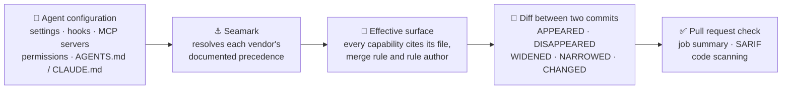

<div align="center">

# ⚓ Seamark

**Change control for what your AI agents can do.**

Seamark reads the configuration your coding agents load, resolves what it actually lets them do, and tells you exactly what changed between two commits.

[](https://github.com/marcosmatalab/seamark/actions/workflows/ci.yml)
[](pyproject.toml)
[](LICENSE)
[](#-verify-this-in-60-seconds)
[](#in-a-pull-request-the-action-and-the-pre-commit-hook)
[](#in-a-pull-request-the-action-and-the-pre-commit-hook)

**Seamark 3.0.0** · Apache-2.0 · one runtime dependency · offline, no telemetry, no account

**[Español](README.es.md)** · [What it does](#-what-it-does-in-plain-words) · [Quickstart](#-quickstart) · [Trade-offs](#-design-trade-offs) · [Commands](docs/COMMANDS.md) · [Design](docs/DESIGN.md)

```bash
pip install "git+https://github.com/marcosmatalab/seamark@v3.0.0" && seamark check
```

</div>

---

## 💡 What it does, in plain words

AI coding agents (Claude Code, Cursor, Codex CLI, Gemini CLI) read configuration
from your repository **before you type anything**: hooks that run
commands at session start, MCP servers they connect to, permissions, sandbox
policy, instruction files. One pull request can quietly give an agent new
powers, and no single file tells you what the agent is allowed to do.

**Seamark is the diff for those powers.** It answers three questions:

| | Question | Command |
|:-:|---|---|
| 🔍 | *What can an agent do in this repository right now?* | `seamark check` |
| 🔀 | *What did this pull request add, remove, widen or narrow?* | `seamark diff` |
| 🔏 | *Does the approval I signed still describe what is there?* | `seamark seal` · `seamark verify` (partly built) |

### ⚙️ How it works, in four steps

1. **Read.** It finds the agent configuration of seven sources in the repository,
   and with `--machine` in the user and managed scopes: settings, hooks, MCP
   server lists, permissions, sandbox policy, instruction files. It parses them
   and never runs them; a file it sees but does not read yet is listed, not skipped.
2. **Resolve.** It applies each vendor's documented precedence to compute the
   *effective surface*: what the agent can actually do once every file is merged.
3. **Name.** It runs 32 documented rules over that surface. Each finding cites
   the file, the merge rule (traceable to the vendor page it was read from), and
   the rule's author.
4. **Compare.** It resolves two commits the same way and reports each capability
   as APPEARED, DISAPPEARED, WIDENED, NARROWED or CHANGED, with an exit code CI can act on.



**A real attack, and the real output.** A supply-chain worm plants an agent hook
in a repository; one `diff` names it, cites the rules that fired, and refuses to
guess about what only the user's machine can decide:


---

## 🎯 Why it matters

Agent configuration has become executable surface. A hook in
`.claude/settings.json` runs a shell command the moment a session opens, an
entry in `.mcp.json` is one approval away from launching a server with the
developer's credentials, and a task in `.vscode/tasks.json` can run when the
folder opens. The keyv supply-chain wave of August 2026 used two of them: the
hook and the task.

Code review is poorly placed to catch it:

- **Scattered.** The answer spans several files, scopes and vendors, each with its own merge rules.
- **Opaque in a diff.** A one-line JSON change can grant shell access; a reviewer sees syntax, not capability.
- **Context-dependent.** Whether a line takes effect can depend on files outside the pull request.

Seamark turns that into one reviewable, cited answer: *this pull request gives
the agent a hook that runs at session start, and here is the rule that says why
that matters.*

---

## 📊 At a glance

<div align="center">

| 🧪 Quality | 📦 Scope | ⚙️ Integration |
|---|---|---|
| **2,714 tests**, run on Python 3.11, 3.12 and 3.13 | **32 documented rules** from versioned packs | **7 CLI commands**, one runtime dependency |
| **Coverage gate** in CI: the floor is 88 and the tree measures 90 | **15,989 lines of product code** | GitHub Action, pre-commit hook, SARIF 2.1.0 |
| Release gate over every figure, flag and claim status | **4 versioned contracts** published as JSON Schema | Self-contained HTML report, no network |

</div>

Every number above is measured by a command in this repository and checked by
the release gate; [the table below](#how-the-repository-is-held-up-) shows which
command produces each one.

### ✨ Why it stands out

- 🧩 **Multi-vendor, precedence-exact.** Each vendor is resolved against the
  merge order its own documentation publishes, and the repository's surface is
  the union of all of them.
- 📎 **Every finding is cited.** The file it came from, the merge rule with the
  vendor page's URL, the date it was read and a digest of the page, and the rule
  that named it with its author and pack.
- 🔒 **Safe by construction.** It never executes what it reads, and `diff` reads
  git objects directly: no checkout, no hooks, no filters, HEAD never moves.
- ❔ **Never guesses.** Anything that cannot be resolved from the repository is
  reported as INDETERMINATE with its cause, counted apart from the answers.
- 🔏 **Signed, offline-verifiable baselines.** Ed25519 keys with rotation and
  revocation, bound to digests, never to names or dates.
- 📴 **Private by default.** No account, no telemetry; `check`, `diff`, `seal`
  and `verify` work fully offline.
- 🌍 **Bilingual.** Tool messages in English and Spanish (`--lang es`); a rule's
  own text stays in the language its author wrote it in.
- 🛡️ **Hardened release pipeline.** The release workflow builds on a CI runner and
  signs SLSA build provenance; every third-party action is pinned by commit SHA.
- ✅ **Self-verifying documentation.** The release gate checks every command,
  flag, figure and claim status on this page against the code.

---

## ⏱ Verify this in 60 seconds

No account and no agent needed; after the install, everything runs offline:

```bash
git clone https://github.com/marcosmatalab/seamark && cd seamark
pip install -e . && python scripts/demo_keyv.py     # the keyv diff pictured above
```

And the whole gate, which takes longer:

```bash
pip install -e ".[dev]" && make all   # lint, the suite with its coverage floor, the measured figures, the two gates
```

If `make all` is green, every command, flag, figure and claim status on this
page matches the code: the release gate parses the page and fails the build on
any drift.

---

## 🧭 What this is

A change-control tool for agent configuration: it reads, resolves and reports,
and it never blocks and never runs anything. Configuration arrives from several
scopes at once (managed, user, project, local), and Seamark resolves each
vendor's ladder the way that vendor documents it.

### The three claims

Seamark makes exactly three claims. Each block below names the commands it
rests on, and `scripts/release_check.py` resolves those names against the
parser in both directions, so a claim here cannot drift from the code.

**1. Surface** - what an agent can do here, resolved across scopes and
vendors. Every capability cites the file it came from, the documented merge
rule that resolved it with the URL, the date read and a digest of the vendor
page that states it, and the Seamark rule that names it.

> **Built.** Commands: `seamark check`.
> Claude Code, Codex CLI, Cursor, Gemini CLI, the VS Code task and settings
> files, `devcontainer.json`, and the AGENTS.md / CLAUDE.md / GEMINI.md
> instruction files, each against its own documented precedence. A repository's
> surface is the union of the seven, never a merge of them.

**2. Change** - which capability appears, disappears, widens or narrows between
two moments.

> **Built.** Commands: `seamark diff`, `seamark seal`.
> Two git refs, or two directories, compared without checking either of them
> out. What arrives, what goes, what widens, what narrows, what changed with
> both digests, and separately whatever could not be resolved on either side.
> The Action runs it on every pull request, where the change arrives.

**3. Currency** - whether an approval or a piece of evidence still describes
what is there. Bound to digests, never to names and never to dates.

> **Partly built.** Commands: `seamark seal`, `seamark verify`.
> `seal` signs a baseline that carries no content, bound to the surface's
> digest, and `verify` checks it offline without trusting whoever produced it.
> An approval is tied to exactly the configuration it approved, and shows the
> moment it stops describing the tree.

**Beyond the three claims**, two commands read what an agent DID rather than
what it can do, and one manages a key.

> **Outside the three claims.** Commands: `seamark scan`, `seamark watch`,
> `seamark keygen`.
> `scan` and `watch` are the [capture ladder](#-capture-levels), which is about
> a run rather than a configuration; `keygen` manages the key `seal` signs
> with.

---

## 🚀 Quickstart

```bash
pip install "git+https://github.com/marcosmatalab/seamark@v3.0.0"
```

One runtime dependency (`cryptography`). No account, no network. To work on the
tool itself, clone it and `pip install -e ".[dev]"` instead.

Here is what the product is for, on the 4 August 2026 keyv supply-chain wave,
reconstructed from the published reports. `scripts/demo_keyv.py` builds a
throwaway repository with two commits, clean and then compromised, and diffs them; its
output is the picture [at the top of this page](#-what-it-does-in-plain-words).
The same output as text, to copy or to diff, is in
[`docs/COMMANDS.md`](docs/COMMANDS.md), where the suite runs it and compares it
against what the tool prints.

The worm plants two things and Seamark reports both: the Claude Code hook is
EFFECTIVE and named by two rules, and the `.vscode/tasks.json` task is
INDETERMINATE, because whether it runs is decided by a setting that lives only
on the user's machine. Seamark says so instead of guessing.

The reconstruction is in `tests/fixtures/surface/keyv-august/`, its provenance
file cites the sentence each fragment comes from, and the `setup.mjs` the hook
points at is an inert stub.

The same run also writes a self-contained HTML report with
`--html report.html`. No script inside and nothing fetched from the network,
so it opens anywhere:


And with no agent installed and nothing configured:

```console
$ seamark scan --demo

Reading the synthetic demo session shipped with the package.
  1 session(s), 4 tool call(s), from 2026-03-04T09:15:00.000Z to 2026-03-04T09:15:15.000Z
  1 session(s) declare a gap: something happened that was not observed

CAPTURE LEVEL L0: this transcript was written by the agent being audited, about
itself. Authenticity is not evaluated here and cannot be. It is diagnosis and
retrospective analysis, not evidence a third party can rely on. Use `seamark
watch` to record a run from outside the agent.
```

It read a session, said what it saw, and stated precisely what that evidence
can and cannot support. That is the house style. With `--lang es` the output
is in Spanish.

---

## 🔧 The seven commands

```
seamark check     read this repo's agent configuration and resolve what it permits
seamark diff      say what capability changed between two moments
seamark seal      sign a baseline of the surface, carrying no content
seamark verify    verify a signed package offline
seamark keygen    create, rotate or revoke a signing key
seamark scan      read the sessions an agent already recorded on this machine (L0)
seamark watch     record a run from outside the agent, through an MCP proxy (L1)
```

7 CLI commands, and `seamark --help` prints the same seven. The two below are
the product; [`docs/COMMANDS.md`](docs/COMMANDS.md) is the full reference.

### 🔍 `seamark check` - what an agent can do here

`check` reads the agent configuration in this repository, resolves what it
actually permits across scopes and across vendors, and applies the rule packs.
It reads Claude Code, Codex CLI, Cursor, Gemini CLI, `.vscode/tasks.json` and
`.vscode/settings.json`, `devcontainer.json`, and the AGENTS.md, CLAUDE.md and
GEMINI.md instruction files, against 32 documented rules.

Each vendor is resolved against the precedence its own documentation publishes,
because those ladders differ exactly where it matters: Gemini CLI splits its
system scope into two files at opposite ends of its ladder, and VS Code ignores
an application-scoped key written in a workspace file. A repository's surface is therefore the UNION of the
per-vendor surfaces, and two vendors configuring the same MCP server are two
capabilities with the same digest.

```
seamark check                                   # this repository
seamark check --machine                         # and the user and managed scopes
seamark check --agent-version claude-code=2.1.257
seamark check --json                            # a surface/v1 document
seamark check --html report.html                # one self-contained file, no network
```

Built to be pasted into CI safely. It never runs what it reads: of a script a
hook names it records whether it exists, whether it is inside the tree, whether
git tracks it, and its sha256. It prints no literal command, URL or header
without `--with-content`, so a secret in a settings file never reaches a log.

Exit codes: `0` nothing fired and nothing was unresolved, `1` a rule fired, `3`
nothing fired and something could not be resolved, `2` a usage error.

### 🔀 `seamark diff` - what changed

```
seamark diff main HEAD                          # two refs in this repository
seamark diff --repo ../other main feature       # somewhere else
seamark diff --from-dir a --to-dir b            # two trees, no git
seamark diff main HEAD --html report.html       # and the same report as a page
seamark diff main HEAD --sarif seamark.sarif    # SARIF 2.1.0 for a code host
```

Neither ref is checked out. The two trees are read with `git ls-tree` and
`git cat-file`, which run no hook, apply no filter and no textconv driver, into
a temporary directory removed on the way out. Your working tree is untouched,
your HEAD does not move, and a `post-checkout` hook in the repository being
examined never gets the chance to run. A ref that starts with a dash is refused
with exit code `2`.

A capability APPEARED, DISAPPEARED, WIDENED, NARROWED or CHANGED; if either side
could not be resolved, the change is INDETERMINATE and listed separately with
its cause. Widened and narrowed are used only where a fact's own name says which
value is wider, such as `guardrail_removed` going from false to true. Everywhere
else the answer is CHANGED, with both digests, so the reviewer decides.

Exit codes: `1` a rule fired on something that was added or widened, `3` no rule
fired and something could not be resolved, `0` otherwise, `2` a usage error.
A finding that was already there is what `check` is for; `diff` reports change.

### In a pull request: the Action and the pre-commit hook

The Action is this repository. `uses: marcosmatalab/seamark@<sha>` installs the
tool from the ref you pinned and runs `diff` between the pull request's base and
head:

```yaml
name: seamark
on: pull_request
permissions:
  contents: read
jobs:
  surface:
    runs-on: ubuntu-latest
    steps:
      - uses: actions/checkout@fbc6f3992d24b796d5a048ff273f7fcc4a7b6c09  # v5
        with:
          fetch-depth: 0       # diff needs both commits; the simplest way to have them
          persist-credentials: false
      - uses: marcosmatalab/seamark@2c25f4981b12ff3f0854bbb79e2eaecb0a4be5ec
```

**Both `uses:` are pinned to a commit SHA, on purpose.** A tag is a name and a
name moves, and an unpinned dependency is exactly what ACT-S011 flags in MCP
servers, so the example follows its own advice. Resolve a tag to its SHA with
`gh api repos/<owner>/<repo>/git/ref/tags/<tag> --jq .object.sha`.

It writes the report into the job summary and SARIF 2.1.0 to `seamark.sarif`.
Uploading that to code scanning is one step with
`github/codeql-action/upload-sarif`, and this repository does it on its own
pushes: the `dogfood` job runs this Action over Seamark and sends the result to
Seamark's own Security tab. The exit code passes through untouched, so a rule
that fired on something new fails the job. `comment: true` posts the summary as
a pull request comment and needs `pull-requests: write`, so it is off by default.

**Use it with `pull_request`, not with `pull_request_target` checking out the
head ref**, which gives a fork's code a writable token and your secrets. Every
input reaches the shell through `env` rather than `${{ }}` interpolation, every
third-party action in this repository's workflows is pinned by commit SHA, and
`zizmor` audits `action.yml` and `.github/workflows/` on every build.

For a local hook, this repository publishes one:

```yaml
repos:
  - repo: https://github.com/marcosmatalab/seamark
    rev: 2c25f4981b12ff3f0854bbb79e2eaecb0a4be5ec
    hooks:
      - id: seamark-check
```

`check` and not `diff`, because `pre-commit` has one tree in front of it and a
diff needs two moments. The place two moments exist is the pull request.

---

## 🪜 Capture levels

Every record declares the level it was captured at, and **the level decides what
the record is allowed to claim**. That is the difference between evidence and
diagnosis.

| Level | What it is | What it can claim | In Seamark |
|---|---|---|---|
| **L0** | The transcript the agent wrote itself, as Claude Code saves it to disk. Carries tool calls with their arguments. | **Cannot claim authenticity.** The audited party produced it. Diagnosis and retrospective analysis, not evidence for a third party. | `seamark scan` |
| **L1** | An MCP proxy. Captured from outside the agent. | Sees tool calls. | `seamark watch` |
| **L2** | A network proxy. | Sees tool calls and the calls to the model provider. | defined in the trace format |
| **L3** | A sandbox with seccomp. | Sees files, network and execution. The only level that can claim nothing else was touched. | defined in the trace format |

---

## 🧱 Design invariants

Four invariants. They are the argument, not a style guide, and a change that
violates one is rejected without discussion.

**1. Never a number.** No score, grade, rating, percent, confidence or ranking
in any emitted document. A rule may carry a `severity` its package author wrote:
that is an attributed label, never aggregated with another.

**2. Never judge, only cite.** Seamark compares what was observed against a norm
**written by somebody else** and names it, publishing that rule's id, version,
package and author. No model sits on the decision path. The 32 documented rules
ship in the `core` pack, attributed to its author like any other pack.

**3. Never infer the unobserved.** A predicate with no information returns
INDETERMINATE, never False. Every rule declares what it needs in order to
answer, and below that it returns INDETERMINATE on its own.

**4. Never act on what is observed.** Seamark *suggests* the remediation its
rule carries; it never applies it. A witness that also acts cannot attest to its
own acts. An exit code **informs**; whether a pull request is blocked is your
branch protection.

Each is asserted over code that exists: the first by
`tests/test_no_aggregate.py` over every document this tree emits, the second by
every finding carrying its rule's author and pack, the third by `Clause.holds`
returning None for a fact nobody wrote down, and the fourth by `diff` reading
two trees without checking either of them out.

---

## 📐 Design trade-offs

Every choice below buys something and costs something, on purpose. Each follows
from the invariants above; the reasoning is in [`docs/PRINCIPLES.md`](docs/PRINCIPLES.md)
and [`docs/DESIGN.md`](docs/DESIGN.md).

| Decision | What you gain | What it costs |
|---|---|---|
| **Read, never execute** | Built to run on untrusted pull requests | It reports what configuration *declares*, not what ran |
| **INDETERMINATE over a guess** | An unknown is never reported as safe | Some answers are left to a human, such as settings only the user's machine holds |
| **Cited rules, no scores** | Every finding is attributable and auditable | No single risk number to sort a backlog by |
| **No model on the decision path** | Same input, same bytes; the release gate re-runs the output under two hash seeds | Coverage is exactly what the rule packs describe |
| **Git objects, not a checkout** | No hook, filter or textconv driver ever runs | Each side is copied to a temporary tree, and an oversized tree is refused rather than read in part |
| **Offline, one runtime dependency** | Air-gapped use and a minimal supply chain | No hosted dashboard; reports are files you keep |

---

## 🔖 Where this comes from

This repository was called **Actaira** until 3.0.0. That name belongs to a
different product by the same author, the AI Act platform, which lives in its
own repository and at `actaira.com`, so this one took its own name. The
distribution, the command and the import path are all `seamark`. The tag `v2.3.0` is the model scanner this
repository used to be, archived whole under the name it was released with.
[`CHANGELOG.md`](CHANGELOG.md) draws the line between the two.

---

## How the repository is held up 🧰

Every figure below comes from a command. Run any of them and compare.

| Claim | Command | Result |
|---|---|---|
| 2,714 tests | `python -m pytest --collect-only -q -o addopts=` | the same count |
| 15,989 lines of product code | `find src -name '*.py' \| xargs cat \| wc -l` | the same count |
| 43,570 lines of Python in the tree | `python scripts/figures.py` | `docs/FIGURES.md`, per area |
| 32 documented rules | `python scripts/rules_doc.py` | `docs/RULES.md`, from the packs |
| 7 CLI commands, and no eighth | `seamark --help` | the seven above |
| the coverage floor holds | `make test-cov` | the floor is 88 and the tree measures 90 |
| the tree agrees with itself | `python scripts/release_check.py` | every check named, or a named failure |

The package ships 6 schema documents: 4 versioned contracts that are live, and
2 superseded versions that are read and never written. The index is
[`docs/CONTRACTS.md`](docs/CONTRACTS.md), generated from the schemas the package
ships, and [`docs/COMPATIBILITY.md`](docs/COMPATIBILITY.md) records what
superseded each and why. Field names follow the OpenTelemetry GenAI semantic
conventions.

```bash
make all      # lint, test-cov, figures, release-check, history-check
```

Two of those are gates rather than decoration. `scripts/release_check.py`
refuses a tree whose parts disagree: a figure that drifted from what the code
measures, a flag the documentation shows that the command does not have, a make
target a page names that does not exist, a fixture nothing reads, a claim on
this page that the parser contradicts. `tests/test_reachability.py` fails on a
module no command can reach, and `tests/test_layering.py` says what each package
may import and fails on an edge the architecture does not allow.

The suite runs in CI on Python 3.11, 3.12 and 3.13, and this repository runs its
own Action on its own pushes and uploads the result to code scanning.
[`docs/ENGINEERING.md`](docs/ENGINEERING.md) has the gates, the type ratchet and
the defect ledger.

---

## 📚 Documentation and licence

| | |
|---|---|
| [`docs/COMMANDS.md`](docs/COMMANDS.md) | The seven commands in full, with their flags and exit codes. |
| [`docs/PRINCIPLES.md`](docs/PRINCIPLES.md) | What Seamark is, the invariants, and the rules the work follows. |
| [`docs/DESIGN.md`](docs/DESIGN.md) | Every design decision with its rejected alternative, each naming the file and line that implements it. |
| [`docs/RULES.md`](docs/RULES.md) | Every rule, with its author, its version, the facts it needs and its violating configuration. Generated from the packs. |
| [`docs/CONTRACTS.md`](docs/CONTRACTS.md) · [`docs/COMPATIBILITY.md`](docs/COMPATIBILITY.md) | What the documents promise, and what is promised across versions. |
| [`docs/ENGINEERING.md`](docs/ENGINEERING.md) · [`docs/BACKLOG.md`](docs/BACKLOG.md) | The gates, the defect ledger and the roadmap. |
| [`docs/GOVERNANCE.md`](docs/GOVERNANCE.md) | The written boundary between this open core and any hosted product. |
| [`docs/archive/`](docs/archive/) | The model scanner's documentation, archived unedited. |

📌 The published limits live in [`docs/LIMITS.md`](docs/LIMITS.md).

This repository is the open core: the CLI, the trace format, the rule packages
and the report. [`docs/GOVERNANCE.md`](docs/GOVERNANCE.md) writes down in advance
what would and would not be allowed to cross into a hosted product.

[`CONTRIBUTING.md`](CONTRIBUTING.md), [`CODE_OF_CONDUCT.md`](CODE_OF_CONDUCT.md),
[`SECURITY.md`](SECURITY.md). Licensed under [Apache-2.0](LICENSE).
