<div align="center">


**Continuous, verifiable assurance for AI models and agents.**

Actaira detects what changed, shows which evidence stopped counting, traces exactly what is affected, and proves why. It inspects model artifacts without executing them, finds the routes an agent can be walked down, decides under policy as code, and maps technical evidence to EU AI Act obligations.

**Actaira 2.3.0** · Python 3.11 · 3.12 · 3.13 · MIT · one runtime dependency · local-first, no telemetry, no account

**[Español](README.es.md)** · [What it does](#what-actaira-does) · [Quickstart](#quickstart) · [EU AI Act](#the-eu-ai-act) · [Architecture](#architecture) · [Evaluation](#evaluation) · [Docs](#where-the-rest-lives)

</div>

---

## What Actaira does

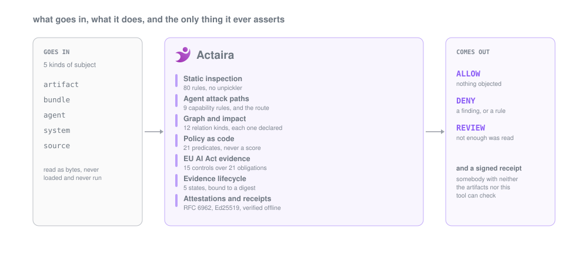

Actaira reads an AI system **without running it**, records what it observed as evidence **with a lifetime**, decides under a **versioned policy**, and signs a **receipt a third party can verify offline**.

Nothing is ever loaded, deserialised or executed. Nothing is ever scored.

---

## In numbers

| | | |
|---|---|---|
| **80 documented rules** | **15 executable controls** | **21 obligations** modeled |
| **3,594 tests**, none of them hand-written figures | **7 connectors** that never decide | one runtime dependency |

**No network is required** for local scanning, governance or offline verification. Remote discovery and RFC 3161 time anchoring reach the network only when you ask them to, `bundle` and `discover` take `--offline` to forbid it outright, and nothing here ever phones home: there is no telemetry, no account and no hosted service.

Every figure on this page is measured by `make figures` and refused by the release gate if it drifts. [`docs/FIGURES.md`](docs/FIGURES.md) is where the measurement lands, source by source.

---

## See it

`actaira serve` is the same engine behind a stdlib HTTP server on 127.0.0.1, with no framework, no bundler, no CDN and no external font. It reads; it decides nothing the CLI would not.

**Inspect.** Drop an artifact in, and the verdict arrives with the digest, the rule ids, the evidence behind each finding, and the coverage of the claim:

<picture>
  <source media="(prefers-color-scheme: dark)" srcset="docs/img/03-inspect-dark.png">
  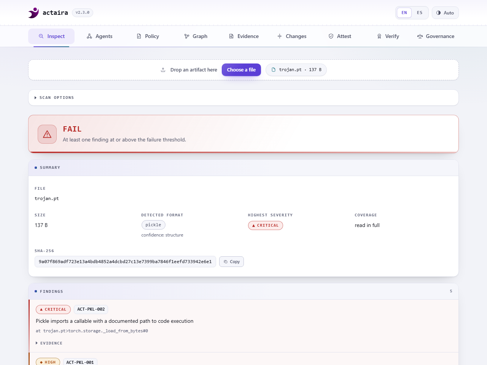
</picture>

**Govern.** Pick a role and a date, and the panel shows which obligations bind, which are outside what any file can show, and why each one sits where it does:

<picture>
  <source media="(prefers-color-scheme: dark)" srcset="docs/img/05-governance-dark.png">
  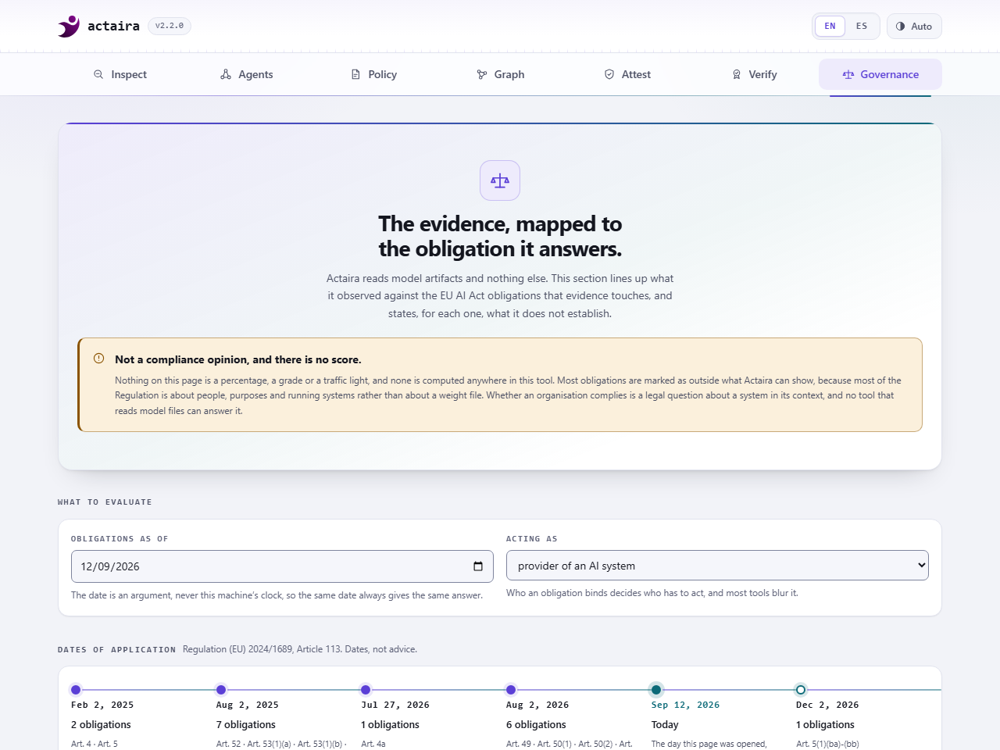
</picture>

Both panels are in English and Spanish, light and dark, and every capture is regenerated by `make screenshots` from a running server: the pass fails on a console error, a page error, a failed request or a Content-Security-Policy violation, so a picture here cannot show a version of the interface that no longer exists.

The interface covers inspection, agents, policy, the asset graph and impact, the evidence ledger, the change timeline and decision validity, attestation, verification and governance. The rest of the engine is reachable from the CLI, and [the roadmap](#scope) says which parts are next. `tests/test_cli_ui_parity.py` holds that sentence to the routes the server actually answers, in both directions, so it cannot quietly stop being true.

---

## Why it exists

**Evidence goes stale and nothing tells you.** A scan report is true about the bytes it read on the day it read them. The moment the weights move it is a statement about a file that no longer exists, and most tooling keeps showing it. Actaira binds every piece of evidence to a digest and supersedes it when that digest is gone.

**A signature proves origin, not innocuousness.** [OpenSSF Model Signing](https://github.com/ossf/model-signing-spec) and [sigstore/model-transparency](https://github.com/sigstore/model-transparency) answer *who signed this, and are the bytes intact*, correctly, in production, and their own documentation says they do not scan for malicious content. A model can be perfectly signed by a legitimate identity and still carry a gadget.

**A percentage is not a compliance answer.** Compliance platforms report a posture built from assertions a human typed, and weighting obligations of different kinds needs a number nobody has. Actaira publishes what each control looked at and what it did not, and refuses to produce a score: a test greps every finished document for `score`, `grade`, `rating` and `percent` and fails on any of them.

**A modern model is not a file, and a modern agent is not a tool list.** Four shards, an index, an adapter pointing at a base model somewhere else and a `modeling_custom.py` that `transformers` executes on `trust_remote_code=True`: every file individually benign, the risk in the relations between them. Same shape one level out, where a tool that reads ticket comments is fine, a tool that merges pull requests is fine, and an agent with both is the incident.

**"What else does this reach?" has no answer in a scanner.** Once a weight file moves, the question is which bundles, agents and systems depended on it, along which declared edge, and which stored evidence just stopped being true.

### Where it sits

Categories of tool, not named products. The measured comparison against picklescan, modelscan and fickling is in [`docs/EVALUATION.md`](docs/EVALUATION.md) and the full table is in [`docs/FIGURES.md`](docs/FIGURES.md).

| | Model scanner | Signing tool | GRC platform | Actaira |
|---|:---:|:---:|:---:|:---:|
| Static artifact inspection | yes | no | no | yes |
| Agent attack paths | no | no | no | yes |
| Policy as code | partial | no | partial | yes |
| Evidence with a lifetime | no | no | yes | yes |
| Dependency and impact | no | no | partial | yes |
| EU AI Act evidence mapping | no | no | yes | yes |
| Cryptographic attestation | no | yes | no | yes |
| Offline verification | no | yes | no | yes |
| Refuses to emit a score | varies | n/a | no | yes |

---

## What it covers

### Model artifacts

An exact abstract interpretation of the pickle value stack and memo, plus format detection by content, across PyTorch, ONNX, HDF5, GGUF, safetensors, NumPy and joblib. Never an unpickler, never a suffix.

Every artifact reports **6 coverage surfaces**, each in one of **4 coverage states** with a written reason, printed whether the verdict was good or bad. A surface nobody undertook to read cannot make a verdict inconclusive; one that was in scope and failed still does.

```console
$ actaira scan models/

PASS          clean.safetensors
              format: safetensors (structure)  sha256:d1398981d27e3b57
              coverage
                + artifact metadata            COMPLETE       read end to end
                . raw tensor content           NOT ASSESSED   outside the scope of a static scanner
                . behavioural safety           NOT ASSESSED   would require running the artifact
                . organizational facts         NOT ASSESSED   not a fact any file can carry

FAIL          trojan.pkl
              format: pickle (structure)  sha256:48fc51f766e9c91b
  !! ACT-PKL-002  Pickle imports a callable with a documented path to code execution
       {"callable": "posix.system", "policy": "strict"}
     ACT-PKL-003  Pickle contains opcodes that call or instantiate at load time
       {"execution_opcodes": 1}
              coverage
                + load-time execution          COMPLETE       read end to end
                . raw tensor content           NOT ASSESSED   outside the scope of a static scanner
                . behavioural safety           NOT ASSESSED   would require running the artifact
                . organizational facts         NOT ASSESSED   not a fact any file can carry

2 artifact(s): 1 passed, 1 failed, 0 inconclusive
```

Those two files are built in four lines from literal bytes in [`docs/CONCEPTS.md`](docs/CONCEPTS.md), so the digests above are reproducible: a reader who builds them sees this output character for character, and a test in this repository builds them and checks it.

A repository resolves into a bundle: members, relations and gaps, with `content_identity` kept separate from `structural_digest`, because a digest over layout is not the identity of the weights.

### Agents

**9 capability rules** over an agent declaration, plus an attack-path search that reports the **route** rather than a pair, says what would break it, and reports a route an existing control already closes as closed.

```console
$ actaira agent paths examples/agent-ticket-triage.yaml

  !  ACT-PATH-001  A route carries sensitive material from untrusted input to a way out
     tool:fetch_url  (untrusted input)
       -> agent:ticket-triage  (the model's context)
       -> tool:read_deploy_key  (sensitive read)
       -> agent:ticket-triage  (the model's context)
       -> tool:fetch_url  (sink)
       carries: credentials
       break this route by:
         - require approval on fetch_url
         - stop fetch_url from returning outside text into this conversation, or remove it
         - move the sensitive read into a separate agent whose result never returns to this conversation

  8 open, 0 already closed
```

Separate identities are the common case and they do not close this route: inside one agent every tool writes into one model's context, so a second identity changes who may *read* a credential, not who may *repeat* it.

The same search has a panel: `actaira serve` draws every route as a graph, with the declared relation on each edge and the mitigations that would break it underneath, and compares two declarations to show what a version gained.

<picture>
  <source media="(prefers-color-scheme: dark)" srcset="docs/img/09-agents-dark.png">
  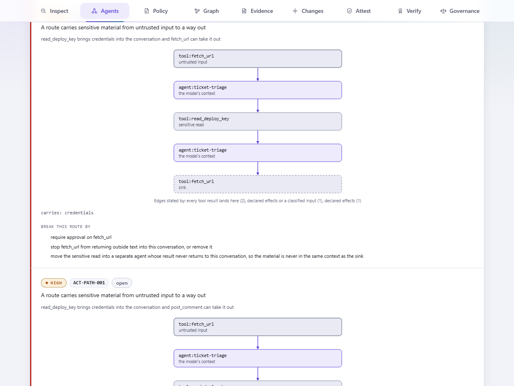
</picture>

### Graph, change and impact

**12 relation kinds**, every edge carrying the name of the manifest, declaration or snapshot that stated it. Nothing is inferred from a name that looks similar. Impact answers with the route, not with a list of everything nearby.

A local SQLite store, stdlib, optional, with forward-only numbered migrations, holds **5 observation states**, because a first sighting and an unchanged one are not the same answer, and **5 evidence states**, superseded by the subject's digest rather than its name, so evidence about a sibling nobody touched stays valid.

**7 connectors** enumerate and stage and never conclude: filesystem, GitHub, Hugging Face, MLflow, OCI, S3 and plain URL. A component that reaches the network never decides a verdict.

`actaira serve --state .actaira/state.db` draws that graph. Declared relationships become an explainable picture, a change becomes an exact route, and every edge says who stated it:

<picture>
  <source media="(prefers-color-scheme: dark)" srcset="docs/img/17-graph-dark.png">
  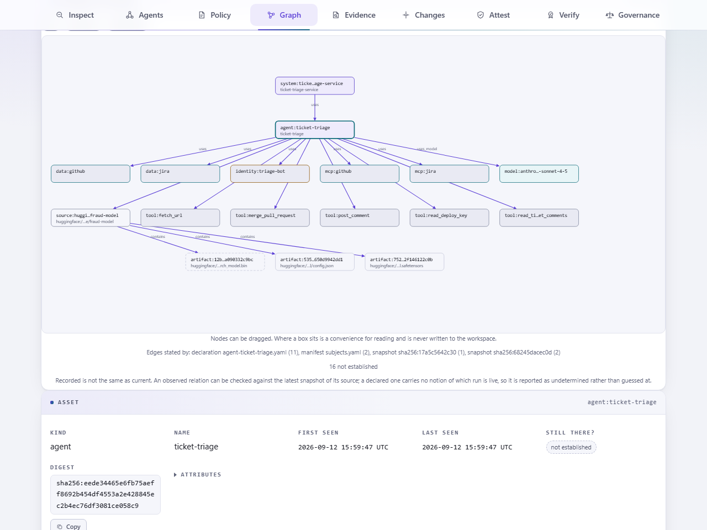
</picture>

Select a node and it answers what depends on it, what it depends on, and what a change to it would reach, each with the chain of edges that gets there. Select an edge and it names the relation, the declaration or snapshot that stated it, and the evidence record behind it when there is one.

The heading says **recorded**, and that is a measured statement rather than a hedge. A relation is not removed when a later observation stops seeing it, so the graph is what this workspace has been told, and whether each part of it is still there is asked separately: confirmed by the latest observation, absent from it, or - for anything a declaration stated - not something this workspace can answer yet. The third answer is shown as the third answer.

The flag is opt-in. Every other panel works with no workspace at all, the interface never creates one, and a database written by an earlier release is reported rather than quietly migrated by a page left open in a tab.

### When something changes

This is the question the rest of the tool exists to answer, and the release where it became answerable end to end:

> **Is the AI system we approved still the AI system we are running?**

A model's bytes are replaced. The evidence bound to the digest that is gone is superseded, and the evidence about its untouched siblings is not. The impact walk starts at that exact artifact, not at the source containing it, and keeps one route per cause. And the ALLOW recorded in August is still an ALLOW, because a tool that overwrote it would have destroyed the only record of what was approved:

<picture>
  <source media="(prefers-color-scheme: dark)" srcset="docs/img/23-changes-dark.png">
  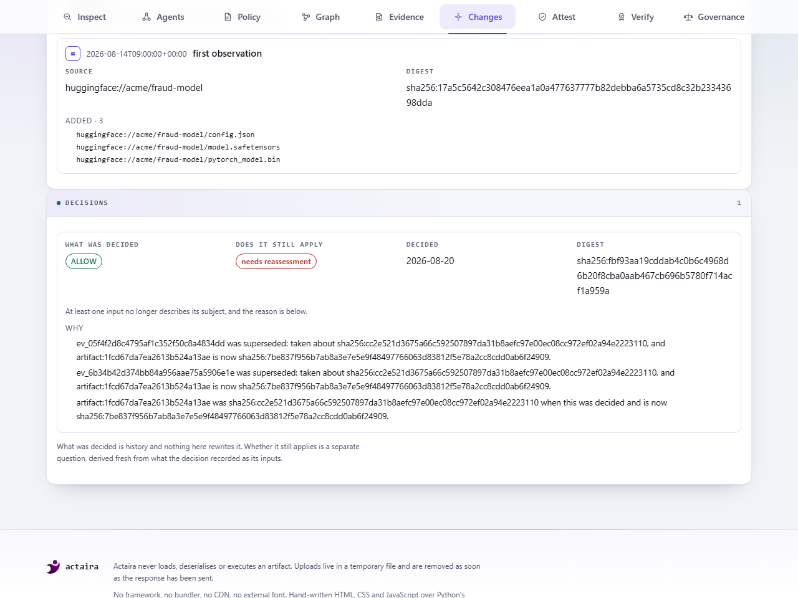
</picture>

Two fields, never merged. **What was decided** is history. **Whether it still applies** is derived fresh from the rows the decision recorded as its inputs, and it has three values: still applies, needs reassessment, or cannot tell. The third is the answer when the store does not hold enough to support either of the others, and a decision filed before dependencies were recorded gets it rather than a quiet yes.

A reassessment is never reached by inference. It needs a row to point at, and the reason is a mapping rather than a sentence:

```json
{"reason": "evidence_superseded", "evidence_id": "ev_6b34b42d...", "state": "superseded",
 "was": "sha256:cc2e521d3675a66c...", "now": "sha256:7be837f956b7ab8a..."}
```

The evidence panel is the other half: every record, what it was taken about, and what its subject looks like now.

<picture>
  <source media="(prefers-color-scheme: dark)" srcset="docs/img/21-evidence-dark.png">
  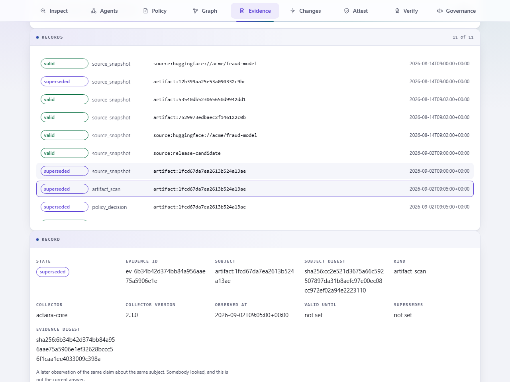
</picture>

Four of the seven evidence kinds have a producer today: `source_snapshot` from `watch`, and `artifact_scan`, `agent_assessment` and `policy_decision` from `scan`, `agent check` and `policy check` when each is given `--state`. `bundle`, `governance` and `attestation` are defined and nothing writes them yet, and a test holds that split so it cannot drift unnoticed.

Both panels read. Revoking a record, marking one untrusted and deleting one all change what a decision may rest on, and none of them is a button.

### Policy as code

**21 policy predicates** over **5 kinds of subject**, one language, ALLOW / DENY / REVIEW. A predicate with no information goes to REVIEW rather than quietly returning false, and the decision carries the rules and evidence that caused it.

Trust is kept apart from cryptography. A signature verifying is a fact about bytes; whether this environment accepts that signer is a local decision. An environment that has written no trust policy has refused nothing, so the answer there is UNKNOWN, never UNTRUSTED.

<picture>
  <source media="(prefers-color-scheme: dark)" srcset="docs/img/13-policy-dark.png">
  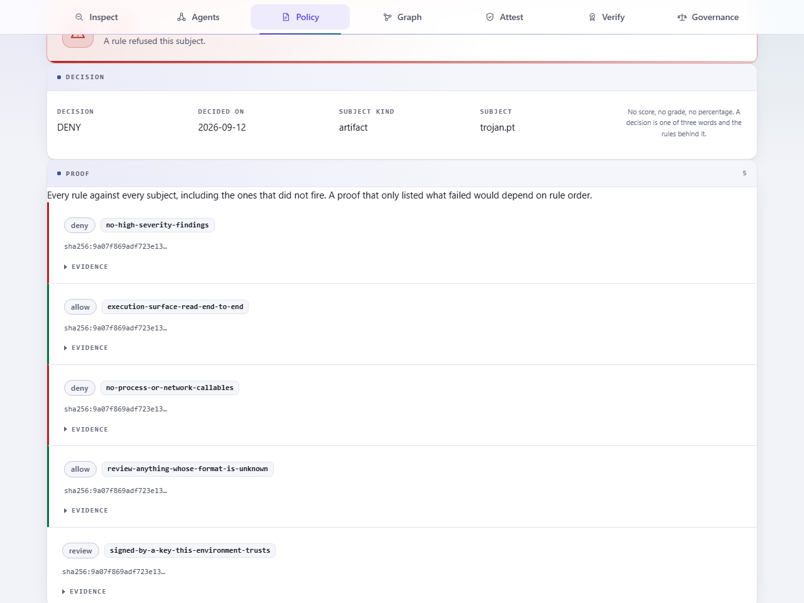
</picture>

### Attestations and receipts

RFC 6962 Merkle tree with inclusion and consistency proofs, Ed25519, optional RFC 3161 time anchor, an in-toto Statement in a DSSE envelope, and a signed receipt verifiable by somebody with neither the artifacts nor this tool. `verify` answers integrity and identity separately and refuses to blur them.

---

## The EU AI Act

**15 executable controls** over **21 obligations**, decided by **role and date** rather than by a checklist. Full treatment in [`docs/GOVERNANCE.md`](docs/GOVERNANCE.md).

```text
   role ──┐
          ├──► which obligations bind, which are forthcoming,
   date ──┘    and which of them any file could ever speak to
                                │
   evidence ────────────────────┘
                                ▼
              what was observed, what was not,
              and a signed dossier saying which
```

Every obligation carries a **checkability tier**: what kind of thing could ever decide it.

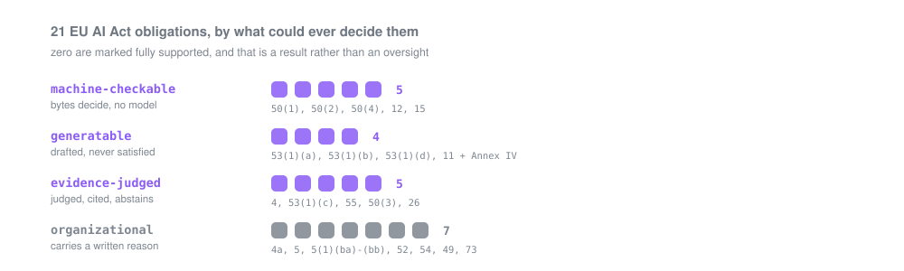

| Tier | What it means | The rule it carries | Obligations |
|---|---|---|---:|
| **Machine-checkable** | A deterministic control parses bytes and decides. No model, reproducible anywhere. | May only answer for what it read. | **5** |
| **Generatable** | The tool drafts the artifact the obligation asks for. | Outcome is never SATISFIED: a draft nobody signed is not evidence. | **4** |
| **Evidence-judged** | Whether a supplied document addresses the obligation is a judgement. A model makes it, a verifier checks every span it cites, and it abstains when it cannot ground the answer. | How often it declines is published, and what was measured was the pipeline. | **5** |
| **Organizational** | Nothing readable from a system can show it. | Carries `why_not`, a written reason. | **7** |

Machine-checkable is **not** compliant: it means a control could look. Partial evidence is **not** a satisfied obligation. Zero obligations are marked as fully supported, and that is a result rather than an oversight.

**Actaira never turns these tiers into a compliance percentage.** 7 of the 21 obligations are organizational and nothing readable from a system can show them, each with a written reason rather than a blank.

---

## Four commands

```bash
# Is this model artifact dangerous?
actaira scan model.pt

# Can this agent be walked to a consequence we care about?
actaira agent paths agent.yaml

# What EU AI Act evidence does this artifact support, for this role?
actaira governance assess model.pt --role provider_gpai

# Can this model enter production under our policy?
actaira policy check model.pt --policy-file policies/production-model.yaml
```

Exit codes are the CI contract: `0` nothing objected, `1` a finding at or above `--fail-on` or a policy DENY, `2` usage, `3` **inconclusive**, or a policy REVIEW. `3` is separate from `0` on purpose, and it is the doctrine of the whole repository: an artifact the tool could not fully read must never be reported as safe.

---

## Quickstart

Python 3.11 or newer, and no ML framework: Actaira never imports torch, onnx or h5py, which is the whole point.

```bash
python -m venv .venv && . .venv/bin/activate      # Windows: .venv\Scripts\activate
python -m pip install .                           # one runtime dependency: cryptography
actaira --version
actaira serve                                     # the local interface, on 127.0.0.1:8765
actaira serve --state .actaira/state.db           # and the recorded asset graph, read-only
```

The five commands that show the loop, in order. `models/` is the two files [`docs/CONCEPTS.md`](docs/CONCEPTS.md) builds in four lines from literal bytes:

```bash
actaira scan models/                                       # what is inside, and would loading it run code
actaira init && actaira source add ./models --id demo      # a local store, and a source to watch
actaira watch demo                                         # observe now, compare with the baseline
actaira policy check models/ --policy-file policies/production-model.yaml
actaira receipt issue models/ --out release.receipt.json \
    --policy-file policies/production-model.yaml --key key.pem
```

`actaira --lang es <command>` switches the output language. The flag is global, so it goes before the subcommand, and a test fails if one language gains a string the other does not have.

There are 24 CLI commands in total, indexed in [`docs/CONCEPTS.md`](docs/CONCEPTS.md), and what each one prints is in [`docs/CLI-OUTPUT.md`](docs/CLI-OUTPUT.md).

To work on the tool rather than with it, `python -m pip install -e ".[dev]"` adds pytest, ruff, numpy, jsonschema and Pillow; the gates are listed in [`docs/ENGINEERING.md`](docs/ENGINEERING.md).

---

## Architecture

A component that can reach the network never decides a verdict, and a component that decides a verdict never reaches the network. That is why a compromised registry can hand Actaira the wrong file and cannot make it say the wrong thing about the file it got.

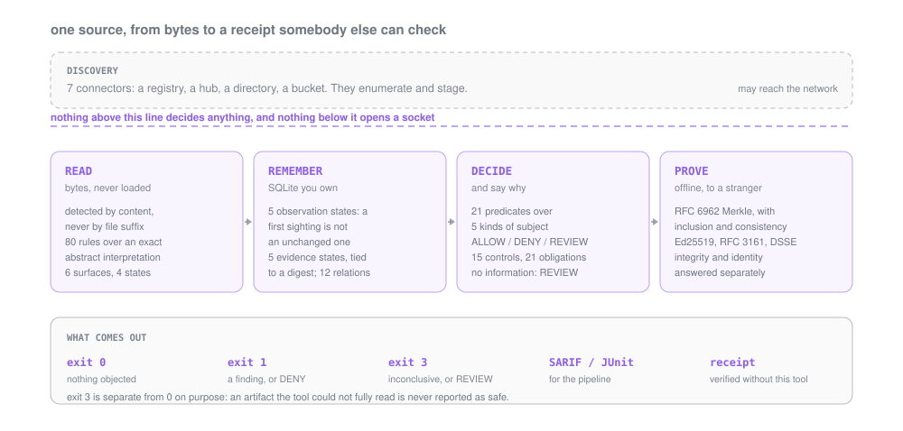

Every count in that picture is read from the registry, the enum or the catalogue that defines it when `make diagrams` runs, so the diagram cannot outlive the code it describes. The one thing in it that is not a number is the dashed line, and it is the reason the picture exists.

And the loop closes. The next observation is compared against the last, so the output is not "what is true now" but **what changed, what that invalidated, and what it reaches**:

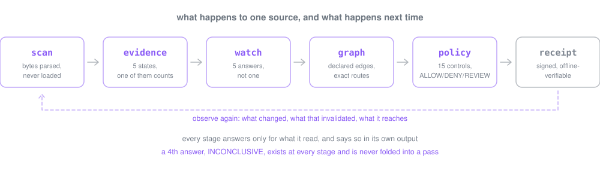

**71,843 lines of Python**, one runtime dependency, and **160 design notes** recording why each decision went the way it did. [`docs/DESIGN.md`](docs/DESIGN.md) is the index; every note names the file and line that implements it, and a test fails if a note in the code is missing from the table.

---

## Evaluation

Four harnesses, all offline, all reproducible, each publishing what it does *not* establish. The methodology is [`docs/EVALUATION.md`](docs/EVALUATION.md); the measured tables are [`docs/FIGURES.md`](docs/FIGURES.md).

**Detection.** On gadget shapes that no denylist enumerates, Actaira's allowlist mode catches **11 of 11** and its own denylist mode catches 1, which is the argument for the allowlist rather than an argument about the other tools. fickling also catches 11 of 11 there, by asking a stricter question, and the full table carries that column: a comparison quoting only the rows where this tool wins would be the kind of claim this repository exists to refuse.

**Marking survival under Article 50(2).**

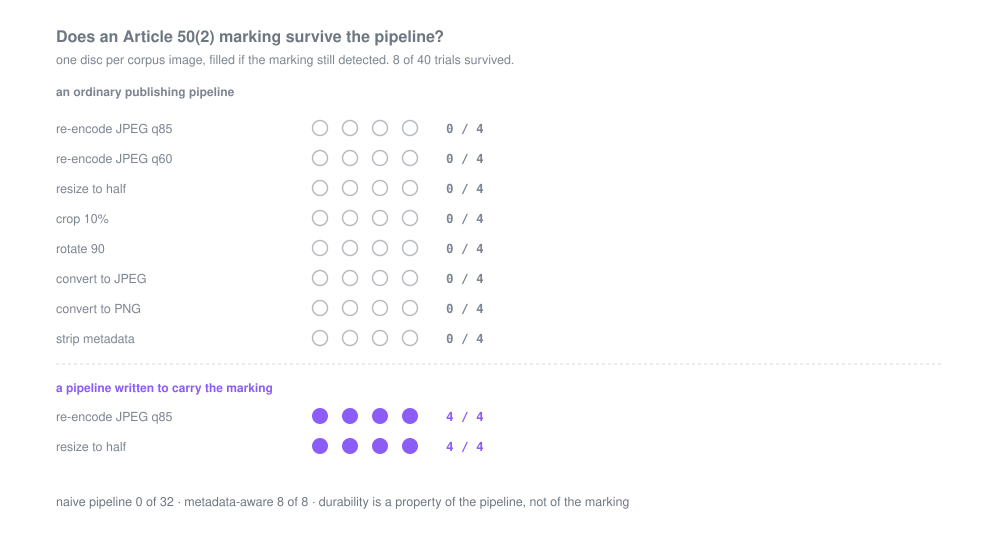

**Naive pipeline: 0 of 32. Metadata-aware pipeline: 8 of 8.** The claim that supports is narrow and defensible: *the durability of a metadata marking is a property of the pipeline, not of the marking*. Any Art. 50(2) implementation that does not control its own pipeline is making a promise it cannot keep.

**The corpus is generated, never downloaded**, so no malware is ever committed here and the artifacts are identical on every platform: 64 corpus artifacts of documented gadget shapes, plus 9 fuzz targets over two engines with deterministic seeds.

**Determinism, measured rather than assumed.** The same artifact must produce the same report twice, or an attestation signed over it means nothing. Every corpus artifact is inspected twice and compared, three commands are run twice under different hash seeds, and the state export is compared byte for byte over one fixed observation. Anything that differs reached the terminal from a set, a dict ordering or a clock.

**Speed, so the gate is one a pipeline will keep.** A median artifact is read in well under a millisecond, and the per-artifact and worst-case timings are in [`docs/FIGURES.md`](docs/FIGURES.md) beside the machine that measured them.

How each of these is produced, and what each one does *not* establish, is in [`docs/EVALUATION.md`](docs/EVALUATION.md). How the tool is held to its own standard, including the ledger of everything ever found wrong in it, is in [`docs/ENGINEERING.md`](docs/ENGINEERING.md).

---

## Security model and limits

[`docs/THREAT-MODEL.md`](docs/THREAT-MODEL.md) is the document. These are the limits it is built on, and none of them is a defect:

- **It cannot prove an artifact is benign.** It reports that it did not find what it knows how to look for.
- **It does not run the model,** so it sees nothing about the weights. A backdoor trained into a network is invisible to static inspection, by construction.
- **It is not a compliance opinion.** The controls record what was observed. Whether an organisation complies is a legal question about a system in its context, and no tool that reads files can answer it.
- **It does not detect signal watermarks.** They cannot be read without the detector key, so a tool claiming to check for watermarks in general would be claiming to see what it cannot.
- **The judged tier abstains, and how often is published** rather than tuned away. Its figures measure a pipeline replaying recorded cassettes, not a language model.
- **The corpus is one corpus.** Detection is measured against documented gadget shapes, not against malware in the wild.

The interface keeps the same posture as the engine: a local server bound to 127.0.0.1, a strict Content-Security-Policy with no `unsafe-inline` and no `unsafe-eval`, streamed and bounded uploads, sanitised filenames, and not one byte fetched from outside this machine.

Report a vulnerability privately: [`SECURITY.md`](SECURITY.md).

---

## Where the rest lives

This page is a landing page. The depth is here:

| | |
|---|---|
| [`docs/CONCEPTS.md`](docs/CONCEPTS.md) | The vocabulary and the command index. Start here. |
| [`docs/CLI-OUTPUT.md`](docs/CLI-OUTPUT.md) | What every command prints, reproducibly. |
| [`docs/GOVERNANCE.md`](docs/GOVERNANCE.md) | The EU AI Act model: roles, dates, tiers, controls, dossiers. |
| [`docs/EVALUATION.md`](docs/EVALUATION.md) | The four harnesses, and what each one does not establish. |
| [`docs/ENGINEERING.md`](docs/ENGINEERING.md) | The gates, the type ratchet, the defect ledger. |
| [`docs/ARCHITECTURE.md`](docs/ARCHITECTURE.md) | The module map, and where each decision lives. |
| [`docs/THREAT-MODEL.md`](docs/THREAT-MODEL.md) | What is assumed, and what is refused. |
| [`docs/FORMATS.md`](docs/FORMATS.md) | Every format, and what is read of it. |
| [`docs/CONTRACTS.md`](docs/CONTRACTS.md) | The published schemas and what a version promises. |
| [`docs/COMPATIBILITY.md`](docs/COMPATIBILITY.md) | What is stable and what is explicitly not. |
| [`docs/DESIGN.md`](docs/DESIGN.md) | Every design note, indexed to the line that argues it. |
| [`docs/FIGURES.md`](docs/FIGURES.md) | Every measured number, and the command that produced it. |

---

## Scope

**The Actaira 2.2.x line is feature-complete and stable.** Inspection, coverage, bundles, agent governance and attack paths, persistent state, evidence lifecycle, graph and impact, trust policy, policy as code, attestation with DSSE, signed receipts and the EU AI Act control engine are complete, measured, and reviewed adversarially. This line takes bug fixes, security fixes and documentation, and the measurements move when the code moves.

**The engine is still ahead of the interface, and the gap is narrower than it was.** The CLI reaches every capability above; the local interface covers inspection, agents, policy, the asset graph, impact, evidence, changes, decisions, attestation, verification and governance. Bundles, controls, discovery, sources, watch, snapshots, trust and receipts are reachable from the terminal only today. `evidence`, `changes` and `decisions` moved up in 2.3.0 and the rule that let them is the same rule that keeps the others down: all three commands are readers over stored state and the panels read the same engine functions. `source`, `watch` and `snapshot` are not readers, and showing what they wrote is not a way to run them - which is more tempting to blur now that the interface displays the ledger and the observation history, not less. Which of them is which is not prose: `tests/test_cli_ui_parity.py` records it per capability and fails if a row and the routes disagree, in either direction.

**What is deliberately not here**, and would be a separate product rather than a later commit: no multi-tenant control plane, no SSO or SAML or OIDC, no role hierarchy beyond the roles the Regulation names, no ticketing integrations, no distributed workers, no billing, no hosted dashboard. Actaira runs on a laptop or in CI, against files that are already there, and writes to a SQLite file you own.

---

## Contributing and licence

[`CONTRIBUTING.md`](CONTRIBUTING.md) covers the bar for a change: a rule needs both languages, a defect needs a regression test named in the ledger, and a figure in prose needs a source in the contract. [`CODE_OF_CONDUCT.md`](CODE_OF_CONDUCT.md) applies.

MIT, © Marcos Mata García. **Actaira 2.3.0**, [`CHANGELOG.md`](CHANGELOG.md).
