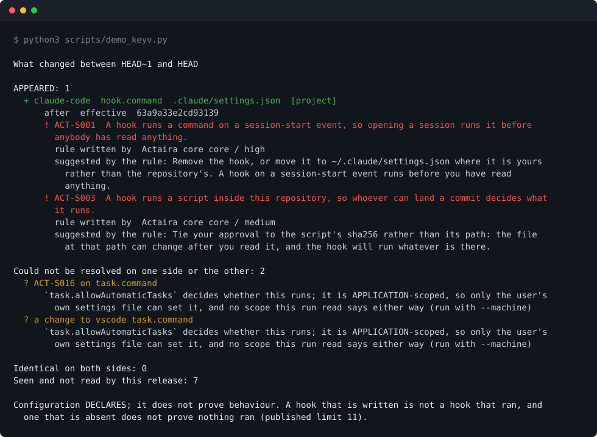

<div align="center">

# Actaira

**Change control for what your AI agents can do.**

Actaira reads the configuration your coding agents load, resolves what it actually lets them do, and says what changed between two moments.

[](https://github.com/marcosmatalab/actaira/actions/workflows/ci.yml)
[](https://pypi.org/project/actaira/)
[](https://pypi.org/project/actaira/)
[](LICENSE)

**Actaira 3.0.0** · Apache-2.0 · one runtime dependency · offline, no telemetry, no account

**[Español](README.es.md)** · [60-second check](#verify-this-in-60-seconds) · [Quickstart](#quickstart) · [Commands](docs/COMMANDS.md) · [Limits](docs/LIMITS.md)

</div>

---

## Verify this in 60 seconds

Every number on this page is measured by a command in this repository rather
than typed. Here is how to check them yourself, offline, with no account:

```bash
pip install actaira && actaira scan --demo     # it runs, with no agent installed
```

And the whole of it, from a clean clone:

```bash
git clone https://github.com/marcosmatalab/actaira && cd actaira
pip install -e ".[dev]"
make all        # lint, the suite with its coverage floor, the measured figures, the gate
```

`make all` is green or this page is wrong. The last step is the one worth
knowing about: it parses the claims on this page and resolves them against the
CLI's own parser, so a sentence here that the code contradicts fails the build.

---

## What this is

An agent opens your repository. Before you type anything it has already read a
settings file that can register a hook to run at session start, a list of MCP
servers to connect to, a permission set, a sandbox policy and an instructions
file. Those files arrive from several scopes at once - managed, user, project,
local - and each vendor documents its own rules for merging them. The answer to
"what can this agent do here" is written down in none of them.

Actaira reads those files, resolves what they add up to, names each capability
with the rule that found it, and says what changed since last time.

It is not a model scanner. It is not an observability platform. It is not a
compliance tool. It is not an EDR: it does not watch at runtime, and it does
not block.

### The three claims, and where each one stands

Actaira claims exactly three things and nothing else. Anything outside those
three is a product defect, even when it is true.

Each block below names the commands its claim rests on, and that is not a
formatting habit: `scripts/release_check.py` reads those names and resolves them
against the parser, in both directions. A block that says "built" while naming a
command nobody wrote fails the gate, and so does a command that works while no
block claims it.

**1. Surface** - what an agent can do here, resolved across scopes and
vendors. Every capability cites the file it came from, the documented merge
rule that resolved it with the URL and version of the vendor documentation that
states it, and the Actaira rule that names it.

> **Built.** Commands: `actaira check`.
> Claude Code, Codex CLI, Cursor, Gemini CLI, the VS Code task and settings
> files, `devcontainer.json`, and the AGENTS.md / CLAUDE.md / GEMINI.md
> instruction files, each against its own documented precedence. A repository's
> surface is the union of the seven, never a merge of them.

**2. Change** - which capability appears, disappears, widens or narrows between
two moments.

> **Built.** Commands: `actaira diff`, `actaira seal`.
> Two git refs, or two directories, compared without checking either of them
> out. What arrives, what goes, what widens, what narrows, what changed with
> both digests, and separately whatever could not be resolved on one side or
> the other. The Action and the pre-commit hook here are the same command,
> where the change arrives.

**3. Currency** - whether an approval or a piece of evidence still describes
what is there. Bound to digests, never to names and never to dates.

> **Partly built.** Commands: `actaira seal`, `actaira verify`.
> `seal` signs a baseline that carries no content, bound to the surface's
> digest, and `verify` checks one offline without trusting whoever produced it.
> So an approval can be tied to a digest today and can be shown to have stopped
> describing the tree. What does not exist is the register that holds those
> approvals and expires them for you; [`docs/DESIGN.md`](docs/DESIGN.md) §10
> keeps the reasoning for it.

And what none of the three may claim, stated here rather than left to be
inferred: **configuration declares; it does not demonstrate behaviour.** A hook
that is written is not a hook that ran, and a hook that is absent is not proof
that nothing ran. Whatever could not be resolved is INDETERMINATE, counted
apart, and never distributed across the answers that were.

**Outside the three claims**, and named rather than left unaccounted for. Two
commands read what an agent DID rather than what it can do, and one manages a
key.

> **Outside the three claims.** Commands: `actaira scan`, `actaira watch`,
> `actaira keygen`.
> `scan` and `watch` are the [capture ladder](#capture-levels), which is about
> a run rather than a configuration; `keygen` manages the key `seal` signs
> with. They are kept because a change to a configuration and the sessions that
> ran after it are the same question asked twice.

---

## Quickstart

```bash
pip install actaira
```

One runtime dependency (`cryptography`). Nothing else, no account, no network.
To work on the tool itself, clone it and `pip install -e ".[dev]"` instead.

Then, what the product is for, on the 4 August 2026 keyv wave reconstructed
from the published reports. The script builds a throwaway repository with two
commits, clean and then compromised, and diffs them:



The same output as text, to copy or to diff, is in
[`docs/COMMANDS.md`](docs/COMMANDS.md), where the suite runs it and
compares it against what the tool prints.

Read the unresolved half, because it is the design. The worm plants two things
and this says so about both: the Claude Code hook is EFFECTIVE and named by two
rules, and the `.vscode/tasks.json` task is INDETERMINATE, because whether it
runs is decided by a setting only the user's own machine can hold, so a
repository cannot answer it and this refuses to guess. Counted apart, never
folded in.

The reconstruction is in `tests/fixtures/surface/keyv-august/`, its provenance
file cites the sentence each fragment comes from, and the `setup.mjs` the hook
points at is an inert stub. A security repository that shipped the worm's
payload in order to demonstrate catching the worm would be the worm.

The same run also writes a self-contained HTML report, with
`--html report.html`. No script inside it and nothing fetched from the network,
so it opens on a machine that has neither:


And with no agent installed and nothing configured:

```console
$ actaira scan --demo

Reading the synthetic demo session shipped with the package.
  1 session(s), 4 tool call(s), from 2026-03-04T09:15:00.000Z to 2026-03-04T09:15:15.000Z
  1 session(s) declare a gap: something happened that was not observed

CAPTURE LEVEL L0: this transcript was written by the agent being audited, about
itself. Authenticity is not evaluated here and cannot be. It is diagnosis and
retrospective analysis, not evidence a third party can rely on. Use `actaira
watch` to record a run from outside the agent.
```

That block is the house style in miniature. It read a session, said what it
saw, and then said, unprompted, that what it read cannot support the claim a
reader would otherwise take it for.

---

## The seven commands

```
actaira check     read this repo's agent configuration and resolve what it permits
actaira diff      say what capability changed between two moments
actaira seal      sign a baseline of the surface, carrying no content
actaira verify    verify a signed package offline
actaira keygen    create, rotate or revoke a signing key
actaira scan      read the sessions an agent already recorded on this machine (L0)
actaira watch     record a run from outside the agent, through an MCP proxy (L1)
```

That is the complete list of what works: 7 CLI commands, and `actaira --help`
prints the same seven. The two below are the product;
[`docs/COMMANDS.md`](docs/COMMANDS.md) is the full reference for all of them.

### `actaira check` - what an agent can do here

`check` reads the agent configuration in this repository, resolves what it
actually permits across scopes and across vendors, and applies the rule packs.
It reads Claude Code, Codex CLI, Cursor, Gemini CLI, `.vscode/tasks.json` and
`.vscode/settings.json`, `devcontainer.json`, and the AGENTS.md, CLAUDE.md and
GEMINI.md instruction files, against 32 documented rules.

Each vendor is resolved against the precedence its own documentation publishes,
because those ladders disagree: Claude Code puts the user's file above the
project's, Gemini CLI puts the project's above the user's, and VS Code puts the
workspace above both. A repository's surface is therefore the UNION of the seven
per-vendor surfaces, and two vendors configuring the same MCP server are two
capabilities with the same digest rather than one row belonging to neither.

What still is not read is printed, not skipped - including the two scopes that
never leave a file at all: Cursor's team hooks, configured in a dashboard and
synced to members, and Codex's MDM and cloud-delivered requirements. Those are
INDETERMINATE with the cause named, never reported as absent.

```
actaira check                                   # this repository
actaira check --machine                         # and the user and managed scopes
actaira check --agent-version claude-code=2.1.257
actaira check --json                            # a surface/v1 document
actaira check --html report.html                # one self-contained file, no network
```

Three things it will not do. It never runs what it reads: of a script a hook
names it records four facts - whether it exists, whether it is inside the tree,
whether git tracks it, and its sha256 - and never a fifth. It prints no literal
command, URL or header without `--with-content`, because a settings file can
carry a secret and this report is pasted into CI logs. And it never guesses: a
capability whose answer depends on an agent version nobody stated comes back
INDETERMINATE with the threshold named, counted apart from everything else.

Exit codes: `0` nothing fired and nothing was unresolved, `1` a rule fired, `3`
nothing fired and something could not be resolved.

### `actaira diff` - what changed

```
actaira diff main HEAD                          # two refs in this repository
actaira diff --repo ../other main feature       # somewhere else
actaira diff --from-dir a --to-dir b            # two trees, no git
actaira diff main HEAD --html report.html       # and the same report as a page
actaira diff main HEAD --sarif actaira.sarif    # SARIF 2.1.0 for a code host
```

Neither ref is checked out. The two trees are read with `git ls-tree` and
`git cat-file`, which run no hook, apply no filter and no textconv driver, and
are written into a temporary directory that is removed on the way out. Your
working tree is not touched, your HEAD does not move, and a `post-checkout` hook
in the repository being examined is never given the chance to run - which would
be executing somebody else's code in order to answer a question about somebody
else's code. A ref that starts with a dash is refused with exit code `2`.

Five kinds of change, and a sixth thing that is not one of them. A capability
APPEARED, DISAPPEARED, WIDENED, NARROWED or CHANGED; and if either side could
not be resolved, the change is INDETERMINATE, listed separately with its cause
and never counted with the five. Widened and narrowed only exist where a fact's
own name says which value is the wider one, such as `guardrail_removed` going
from false to true. Everywhere else the answer is CHANGED, with both digests, so
a reviewer can decide for themselves rather than be told what to think about a
vendor's settings.

Exit codes: `1` a rule fired on something that was added or widened, `3` no rule
fired and something could not be resolved, `0` otherwise, `2` a usage error. A
finding that was already there and is still there is not one of these: that is
what `check` is for, and a command that answers "what changed" must not object to
what did not.

### In a pull request: the Action and the pre-commit hook

The Action is this repository. `uses: marcosmatalab/actaira@<sha>` installs the
tool from the ref you pinned and runs `diff` between the pull request's base and
head:

```yaml
name: actaira
on: pull_request
permissions:
  contents: read
jobs:
  surface:
    runs-on: ubuntu-latest
    steps:
      - uses: actions/checkout@fbc6f3992d24b796d5a048ff273f7fcc4a7b6c09  # v5
        with:
          fetch-depth: 0       # diff needs both sides, so the whole history
          persist-credentials: false
      - uses: marcosmatalab/actaira@c0a33675c14b8a622ddb794ab3f516a514e3124d
```

**Both `uses:` are pinned to a commit SHA, and that is not decoration.** A tag
is a name and a name moves, which is what ACT-S003 tells other people about
their own MCP servers and hooks; an example telling you to write `@main` would
be this tool asking of you what it flags in your repository. `@v3.0.0` is the
readable form of that SHA, and the example here stays a digest because that is
the advice. Re-resolve with
`gh api repos/<owner>/<repo>/git/ref/tags/<tag> --jq .object.sha`.

It writes the report into the job summary and SARIF 2.1.0 to `actaira.sarif`.
Uploading that to code scanning is one step with
`github/codeql-action/upload-sarif`, and this repository takes it on its own
pushes: the `dogfood` job runs this Action over Actaira and sends the result to
Actaira's own Security tab. The exit code passes through untouched, so a rule
that fired on something new fails the job; whether that blocks the merge is your
branch protection. `comment: true` posts the summary as a pull request comment
and needs `pull-requests: write`, which is why it is off by default.

**Use it with `pull_request`. Not with `pull_request_target` checking out the
head ref**, which gives a fork's code a writable token and your secrets, and no
care taken inside the Action changes that. Every input reaches the shell through
`env` rather than being pasted into a script by `${{ }}`, every third-party
action in this repository's workflows is pinned by commit SHA, and `zizmor` runs
over `action.yml` and `.github/workflows/` on every build.

For a local hook, this repository publishes one:

```yaml
repos:
  - repo: https://github.com/marcosmatalab/actaira
    rev: c0a33675c14b8a622ddb794ab3f516a514e3124d
    hooks:
      - id: actaira-check
```

`check` and not `diff`, because `pre-commit` has one tree in front of it and a
diff needs two moments. The place two moments exist is the pull request.

---

## Capture levels

Every record declares the level it was captured at, and **the level decides what
the record is allowed to claim**. This is the difference between evidence and
diagnosis, and it is not a detail.

| Level | What it is | What it can claim |
|---|---|---|
| **L0** | The transcript the agent wrote itself - what Claude Code, Cursor or Cline already saved to disk. Carries tool calls with their arguments. | **Cannot claim authenticity.** The audited party produced it. Declared as not evaluated, with the reason written out. Diagnosis and retrospective analysis, not evidence for a third party. |
| **L1** | An MCP proxy. Captured from outside the agent. | Sees tool calls. |
| **L2** | A network proxy. | Sees tool calls and the calls to the model provider. |
| **L3** | A sandbox with seccomp. | Sees files, network and execution. The only level that can claim nothing else was touched. |

`scan` is L0. `watch` is L1. L2 and L3 are not implemented in this tree.

A level nobody attempted cannot make a verdict inconclusive. A level that was in
scope and failed, can - and does.

---

## What Actaira refuses to do

Four invariants. They are the argument, not a style guide. A change that
violates one is rejected without discussion.

**1. Never a number.** No score, grade, rating, percent, confidence or ranking
in any emitted document. A rule may carry a `severity` its package author wrote:
that is an attributed label, not a calculation Actaira performed, and it is
never aggregated with another.

**2. Never judge, only cite.** Actaira has no opinion about what an agent should
have done. It compares what was observed against a norm **written by somebody
else** and names it, publishing that rule's id, version, package and author.
From which it follows: no model on the decision path. An LLM may help draft a
rule; it may not evaluate one and it may not write a remediation.

**3. Never infer the unobserved.** A predicate with no information returns
INDETERMINATE, never False. Every rule declares what it needs in order to
answer, and below that it returns INDETERMINATE on its own, without anybody
remembering to check.

**4. Never act on what is observed.** Actaira *suggests* the remediation its
rule carries; it never applies it. A witness that also acts cannot attest to its
own acts, and that conflict of interest is what separates this from an
observability vendor. An exit code **informs**: whether a pull request is
blocked is your branch protection, which is yours. Leaving with a non-zero
status is not acting; writing in your tree is.

Each of the four is asserted over code that exists: the first by
`tests/test_no_aggregate.py` over every document this tree emits, the second by
every finding carrying its rule's author and pack, the third by `Clause.holds`
returning None for a fact nobody wrote down, and the fourth by `diff` reading
two trees without checking either of them out.

---

## How this was built

Built by one person, with heavy use of an AI coding assistant, over an intense
stretch in September 2026. The commit dates say so and there is no point
pretending otherwise.

What that means in practice, stated so you can judge it rather than guess: the
product decisions, the four invariants, the pivot away from the model scanner
and every rejected alternative in [`docs/DESIGN.md`](docs/DESIGN.md) are mine.
The assistant wrote a large share of the implementation and the tests against
those decisions. Every line was reviewed, and the review is not a claim you have
to take on trust: the gates in this repository exist because assistance at this
speed produces exactly the failure they catch.

`tests/test_reachability.py` is the clearest example. Writing fast left close to
half this tree unreachable from any command, which nobody noticed from inside
any one file. The test now fails on a module no command reaches, and the dead
code is gone. `scripts/release_check.py` is the other one: it parses the claims
in this README and resolves them against the CLI's parser, because a page
written alongside the code it describes drifts from it within days.

If you want to know whether the person behind this understands what is here,
the honest test is [`docs/DESIGN.md`](docs/DESIGN.md): every design decision
with the alternative that was rejected and why. That is the part no assistant
wrote for me.

---

## How the repository is held up

Every figure below comes from a command. Run any of them and disagree.

| Claim | Command | Result |
|---|---|---|
| 2,544 tests | `python -m pytest --collect-only -q` | the same count |
| 15,803 lines of product code | `find src -name '*.py' \| xargs cat \| wc -l` | the same count |
| 39,736 lines of Python in the tree | `python scripts/figures.py` | `docs/FIGURES.md`, per area |
| 32 documented rules | `python scripts/rules_doc.py` | `docs/RULES.md`, from the packs |
| 7 CLI commands, and no eighth | `actaira --help` | the seven above |
| the coverage floor holds | `make test-cov` | the floor is 88 and the tree measures 90 |
| the tree agrees with itself | `python scripts/release_check.py` | every check named, or a named failure |

The package ships 6 schema documents: 4 versioned contracts that are live, and
2 superseded versions that are read and never written. The index is
[`docs/CONTRACTS.md`](docs/CONTRACTS.md), generated from the schemas the package
ships rather than typed, and [`docs/COMPATIBILITY.md`](docs/COMPATIBILITY.md)
records what superseded each and why. Field names follow the OpenTelemetry GenAI
semantic conventions; we do not invent vocabulary where it already exists.

```bash
make all      # lint, test-cov, figures, release-check
```

Two of those are gates rather than decoration. `scripts/release_check.py`
refuses a tree whose parts disagree: a figure that drifted from what the code
measures, a flag the documentation shows that the command does not have, a make
target a page names that does not exist, a fixture nothing reads, a claim on
this page that the parser contradicts. And `tests/test_reachability.py` fails on
a module no command can reach, which is how close to half this tree was found to
be unreachable and removed. `tests/test_layering.py` is the newer one: it says
what each package may import and fails on an edge the architecture does not
allow.

All of it runs in CI on Python 3.11, 3.12 and 3.13, and this repository runs its
own Action on its own pushes and uploads the result to code scanning.
[`docs/ENGINEERING.md`](docs/ENGINEERING.md) has the gates, the type ratchet and
the defect ledger.

---

## Documentation, scope and licence

| | |
|---|---|
| [`docs/COMMANDS.md`](docs/COMMANDS.md) | The seven commands in full, with their flags and exit codes. |
| [`docs/LIMITS.md`](docs/LIMITS.md) | What Actaira cannot show you, and why none of it gets softened to sell better. |
| [`CLAUDE.md`](CLAUDE.md) | What Actaira is, the invariants, and the rules the work follows. The governance document. |
| [`docs/DESIGN.md`](docs/DESIGN.md) | Every design decision with its rejected alternative, each naming the file and line that implements it. |
| [`docs/RULES.md`](docs/RULES.md) | Every rule, with its author, its version, the facts it needs and its violating configuration. Generated from the packs. |
| [`docs/CONTRACTS.md`](docs/CONTRACTS.md) · [`docs/COMPATIBILITY.md`](docs/COMPATIBILITY.md) | What the documents promise, and what is promised across versions. |
| [`docs/ENGINEERING.md`](docs/ENGINEERING.md) · [`docs/BACKLOG.md`](docs/BACKLOG.md) | The gates and the defect ledger; known defects and deferred work. |
| [`docs/GOVERNANCE.md`](docs/GOVERNANCE.md) | The boundary between this open core and a hosted product, if one is ever built. |
| [`docs/archive/`](docs/archive/) | The model scanner's documentation, archived unedited. None of it describes this tree. |

This repository is the open core: the CLI, the trace format, the rule packages,
the report, and in time the self-hostable collector. There is no hosted platform
today; [`docs/GOVERNANCE.md`](docs/GOVERNANCE.md) writes down in advance what
would and would not be allowed to cross into one.

[`CONTRIBUTING.md`](CONTRIBUTING.md), [`CODE_OF_CONDUCT.md`](CODE_OF_CONDUCT.md),
[`SECURITY.md`](SECURITY.md). Licensed under [Apache-2.0](LICENSE).
